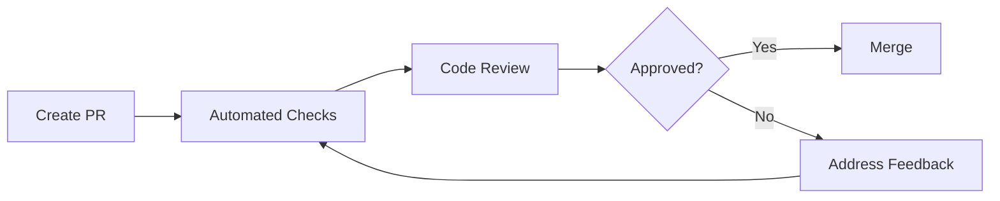

# GitHub Configuration

This directory contains GitHub-specific configuration files for code review, CI/CD, and project management.

## 📁 Directory Structure

```
.github/
├── workflows/                      # GitHub Actions workflows
│   ├── code-review.yml            # Automated code review checks
│   ├── test.yml                   # Test suite
│   ├── security-scan.yml          # Security scanning
│   └── deploy-production-zero-downtime.yml  # Production deployment
│
├── ISSUE_TEMPLATE/                # Issue templates
│   ├── bug_report.yml             # Bug report template
│   ├── feature_request.yml        # Feature request template
│   └── config.yml                 # Issue template configuration
│
├── CODEOWNERS                     # Automatic reviewer assignment
├── pull_request_template.md       # PR template
├── IMPLEMENTATION_CHECKLIST.md    # Implementation checklist
├── WORKFLOW_DIAGRAM.md            # Workflow diagrams
└── README.md                      # This file

docs/code-review/                  # Code review documentation (moved here)
├── CODE_REVIEW_SETUP.md           # Complete setup guide
├── CODE_REVIEW_GUIDELINES.md      # Detailed review guidelines
├── CODE_REVIEW_QUICK_REFERENCE.md # Quick reference guide
├── BRANCH_PROTECTION_SETUP.md     # Branch protection configuration
└── README.md                      # Code review docs overview
```

**Note:** Code review documentation has been moved to `docs/code-review/` for better organization. GitHub-specific configuration files remain in `.github/`.

## 🚀 Quick Start

### For New Team Members

1. **Read the Guidelines**
   - [CODE_REVIEW_GUIDELINES.md](../docs/code-review/CODE_REVIEW_GUIDELINES.md) - How to review code
   - [CODE_REVIEW_QUICK_REFERENCE.md](../docs/code-review/CODE_REVIEW_QUICK_REFERENCE.md) - Quick commands

2. **Understand the Process**
   - [CODE_REVIEW_SETUP.md](../docs/code-review/CODE_REVIEW_SETUP.md) - Complete system overview
   - [pull_request_template.md](pull_request_template.md) - PR requirements

3. **Create Your First PR**
   ```bash
   git checkout develop
   git checkout -b feature/my-feature
   # Make changes
   git push origin feature/my-feature
   # Open PR on GitHub
   ```

### For Repository Admins

1. **Configure Branch Protection**
   - Follow [BRANCH_PROTECTION_SETUP.md](../docs/code-review/BRANCH_PROTECTION_SETUP.md)
   - Set up required status checks
   - Configure approval requirements

2. **Update CODEOWNERS**
   - Edit [CODEOWNERS](CODEOWNERS)
   - Replace placeholder teams with actual teams/usernames
   - Test automatic reviewer assignment

3. **Set Up Secrets**
   - `CODECOV_TOKEN` - For code coverage
   - `SLACK_WEBHOOK_URL` - For notifications (optional)

## 📚 Documentation

### Code Review System

| Document | Purpose | Audience |
|----------|---------|----------|
| [CODE_REVIEW_SETUP.md](../docs/code-review/CODE_REVIEW_SETUP.md) | Complete setup guide | Admins, Team Leads |
| [CODE_REVIEW_GUIDELINES.md](../docs/code-review/CODE_REVIEW_GUIDELINES.md) | Detailed review process | All Developers |
| [CODE_REVIEW_QUICK_REFERENCE.md](../docs/code-review/CODE_REVIEW_QUICK_REFERENCE.md) | Quick commands & tips | All Developers |
| [BRANCH_PROTECTION_SETUP.md](../docs/code-review/BRANCH_PROTECTION_SETUP.md) | Branch protection config | Admins |

### Templates

| Template | Purpose | Usage |
|----------|---------|-------|
| [pull_request_template.md](pull_request_template.md) | Standardized PR format | Auto-loaded on PR creation |
| [bug_report.yml](ISSUE_TEMPLATE/bug_report.yml) | Bug reporting | Select when creating issue |
| [feature_request.yml](ISSUE_TEMPLATE/feature_request.yml) | Feature proposals | Select when creating issue |

### Workflows

| Workflow | Trigger | Purpose |
|----------|---------|---------|
| [code-review.yml](workflows/code-review.yml) | Pull Request | Automated code review checks |
| [test.yml](workflows/test.yml) | Pull Request, Push | Run test suite |
| [security-scan.yml](workflows/security-scan.yml) | Schedule, Manual | Security scanning |
| [deploy-production-zero-downtime.yml](workflows/deploy-production-zero-downtime.yml) | Manual | Production deployment |

## 🔧 Configuration

### CODEOWNERS

The [CODEOWNERS](CODEOWNERS) file automatically assigns reviewers based on file paths:

```
# Backend code
/app/Http/Controllers/ @backend-team

# Frontend code
/resources/views/ @frontend-team

# Database changes
/database/ @database-team

# Infrastructure
/.github/workflows/ @devops-team
```

**To customize:**
1. Edit [CODEOWNERS](CODEOWNERS)
2. Replace `@your-org/team-name` with actual teams or usernames
3. Commit and push changes

### Branch Protection

Recommended settings for `main` branch:

- ✅ Require pull request reviews (2 approvals)
- ✅ Require status checks to pass
- ✅ Require conversation resolution
- ✅ Require linear history
- ❌ Allow force pushes
- ❌ Allow deletions

See [BRANCH_PROTECTION_SETUP.md](../docs/code-review/BRANCH_PROTECTION_SETUP.md) for detailed instructions.

### Required Status Checks

These checks must pass before merging:

- `PHPUnit Tests` - All tests must pass
- `Code Quality` - Laravel Pint style check
- `Frontend Tests` - JavaScript tests
- `Security Review` - Trivy security scan
- `PR Validation` - Title format, size, conflicts

## 🎯 Workflows

### Code Review Workflow



### Pull Request Lifecycle

1. **Create** - Developer creates feature branch and opens PR
2. **Validate** - Automated checks run (tests, style, security)
3. **Review** - Team members review code
4. **Iterate** - Developer addresses feedback
5. **Approve** - Reviewers approve changes
6. **Merge** - PR merged to target branch
7. **Deploy** - Changes deployed (if applicable)

## 🚨 Automated Checks

### PR Validation
- ✅ Check PR title format (Conventional Commits)
- ✅ Check PR size and add labels
- ✅ Check for merge conflicts

### Code Quality
- ✅ Run Laravel Pint (code style)
- ✅ Check for debug statements
- ✅ Check for TODO comments
- ✅ Check for sensitive data

### Security
- ✅ Run Trivy security scanner
- ✅ Check for SQL injection risks
- ✅ Upload results to GitHub Security

### Database
- ✅ Detect migration changes
- ✅ Add review checklist comment
- ✅ Label PR with `database-changes`

### Performance
- ✅ Check for N+1 query patterns
- ✅ Check for missing indexes

### Coverage
- ✅ Run tests with coverage
- ✅ Upload to Codecov
- ✅ Comment coverage on PR

## 📊 Labels

### Automatic Labels

PRs are automatically labeled based on changed files:

| Label | Trigger |
|-------|---------|
| `backend` | Changes in `app/Http/Controllers/` |
| `frontend` | Changes in `resources/views/` or `resources/js/` |
| `database` | Changes in `database/migrations/` |
| `tests` | Changes in `tests/` |
| `ci/cd` | Changes in `.github/workflows/` |
| `docker` | Changes in Docker files |
| `documentation` | Changes in `.md` files |
| `models` | Changes in `app/Models/` |
| `services` | Changes in `app/Services/` |
| `jobs` | Changes in `app/Jobs/` |
| `notifications` | Changes in `app/Notifications/` |

### Size Labels

| Label | Lines Changed |
|-------|---------------|
| `size/XS` | < 100 |
| `size/S` | 100-300 |
| `size/M` | 300-600 |
| `size/L` | 600-1000 |
| `size/XL` | > 1000 |

### Manual Labels

Add these labels manually as needed:

- `bug` - Bug fix
- `enhancement` - New feature
- `breaking-change` - Breaking change
- `needs-review` - Needs review
- `work-in-progress` - WIP
- `blocked` - Blocked by something
- `urgent` - Urgent fix

## 🔒 Security

### Sensitive Data Protection

Automated checks prevent:
- Hardcoded passwords
- API keys in code
- Secret tokens
- Private keys
- AWS credentials

### Security Scanning

- **Trivy** - Vulnerability scanning
- **Composer Audit** - PHP dependency check
- **NPM Audit** - JavaScript dependency check

### Security Issues

Report security vulnerabilities privately:
- Email: security@your-domain.com
- Do not create public issues for security problems

## 🛠️ Troubleshooting

### Common Issues

**Status checks not appearing?**
- Ensure workflows have run at least once
- Check workflow job names match exactly
- Verify workflows run on `pull_request` events

**Can't merge despite approvals?**
- Check all status checks are passing
- Ensure branch is up to date
- Verify all conversations are resolved

**CODEOWNERS not working?**
- Verify team/user has repository access
- Check file path patterns are correct
- Ensure CODEOWNERS file is in `.github/` directory

See [CODE_REVIEW_GUIDELINES.md](../docs/code-review/CODE_REVIEW_GUIDELINES.md#troubleshooting) for more solutions.

## 📈 Metrics

Track these metrics to improve the review process:

- Average PR review time
- Number of PRs requiring changes
- Test coverage trends
- Security scan findings
- PR size distribution

## 🤝 Contributing

To improve the code review system:

1. Open an issue with suggestions
2. Create a PR with improvements
3. Update documentation
4. Share feedback with the team

## 📞 Support

### Getting Help

1. Check documentation in `.github/`
2. Ask in team chat
3. Open a GitHub discussion
4. Contact DevOps team

### Contacts

- **DevOps Team**: devops@example.com
- **Tech Lead**: techlead@example.com
- **Security Team**: security@example.com

## 📚 Resources

### Internal
- [Main Documentation](../DOCUMENTATION_INDEX.md)
- [Contributing Guide](../docs/contributing/CONTRIBUTING.md)
- [Quick Start](../docs/getting-started/QUICK_START.md)

### External
- [GitHub Actions Documentation](https://docs.github.com/en/actions)
- [GitHub Code Review](https://docs.github.com/en/pull-requests/collaborating-with-pull-requests/reviewing-changes-in-pull-requests)
- [Conventional Commits](https://www.conventionalcommits.org/)
- [Laravel Best Practices](https://github.com/alexeymezenin/laravel-best-practices)

## 📅 Maintenance

### Regular Tasks

**Weekly:**
- Review open PRs
- Check for stale PRs
- Ensure reviewers are responsive

**Monthly:**
- Review CODEOWNERS
- Update required status checks
- Check workflow efficiency

**Quarterly:**
- Update review guidelines
- Review branch protection rules
- Gather team feedback

---

**Version**: 1.0.0  
**Last Updated**: 2026-05-04  
**Maintained By**: DevOps Team

For questions or suggestions, open an issue or contact the team! 🚀
