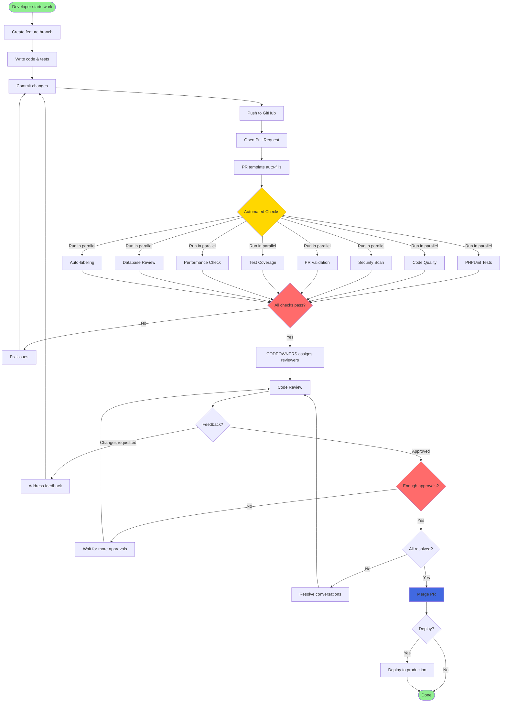
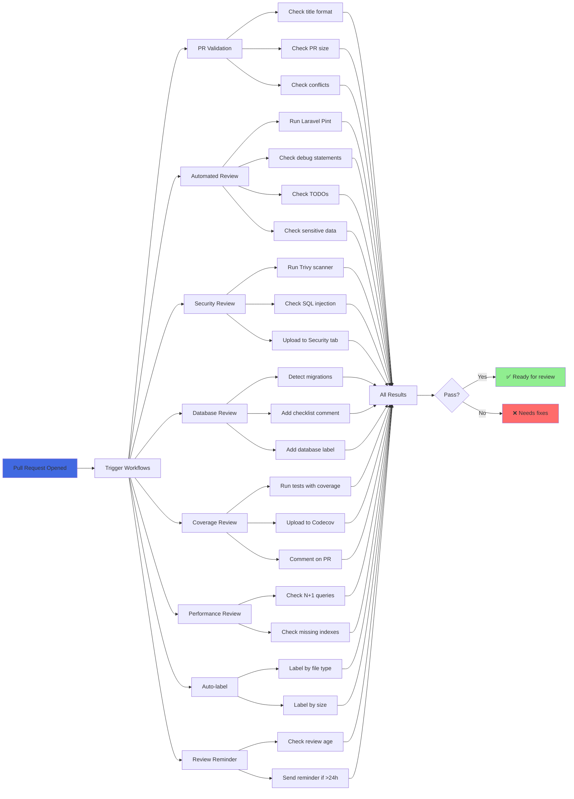
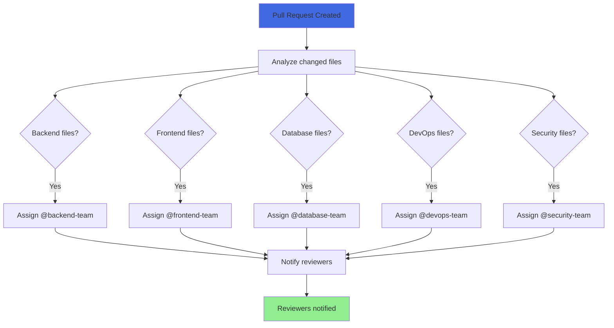
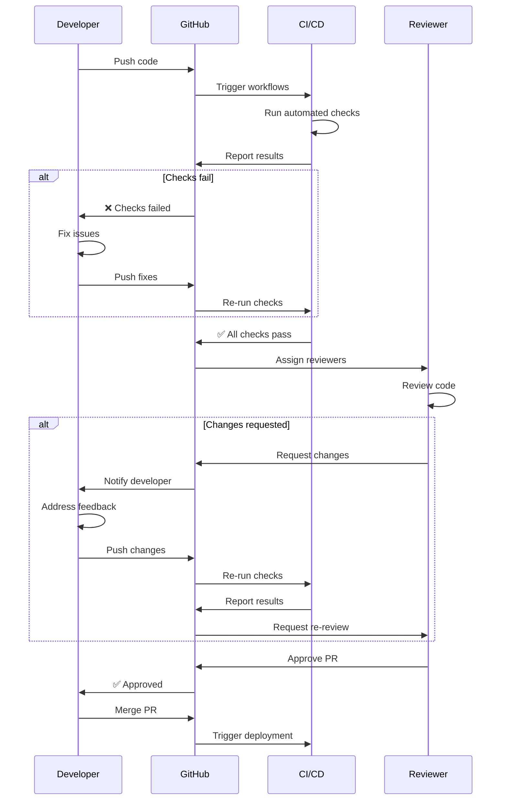
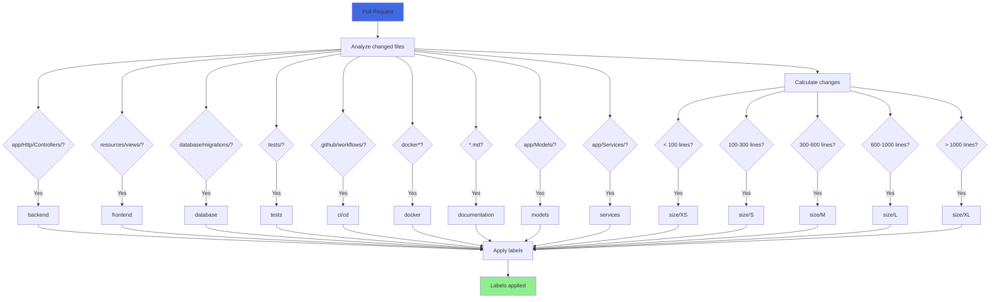
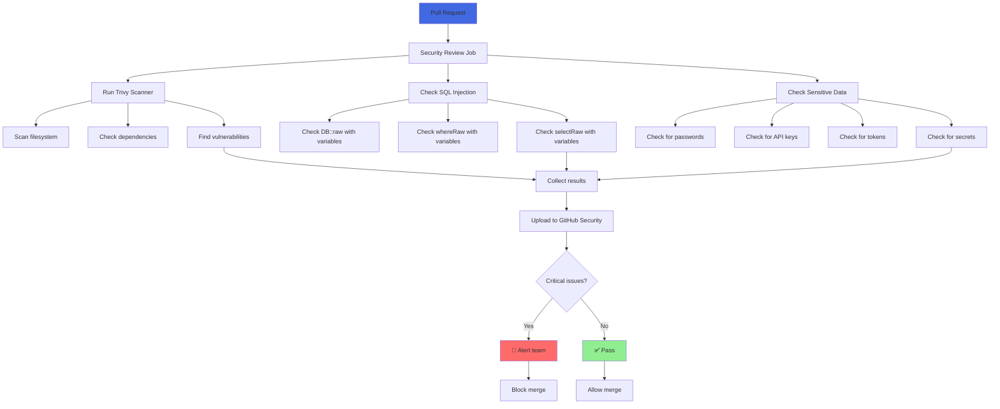
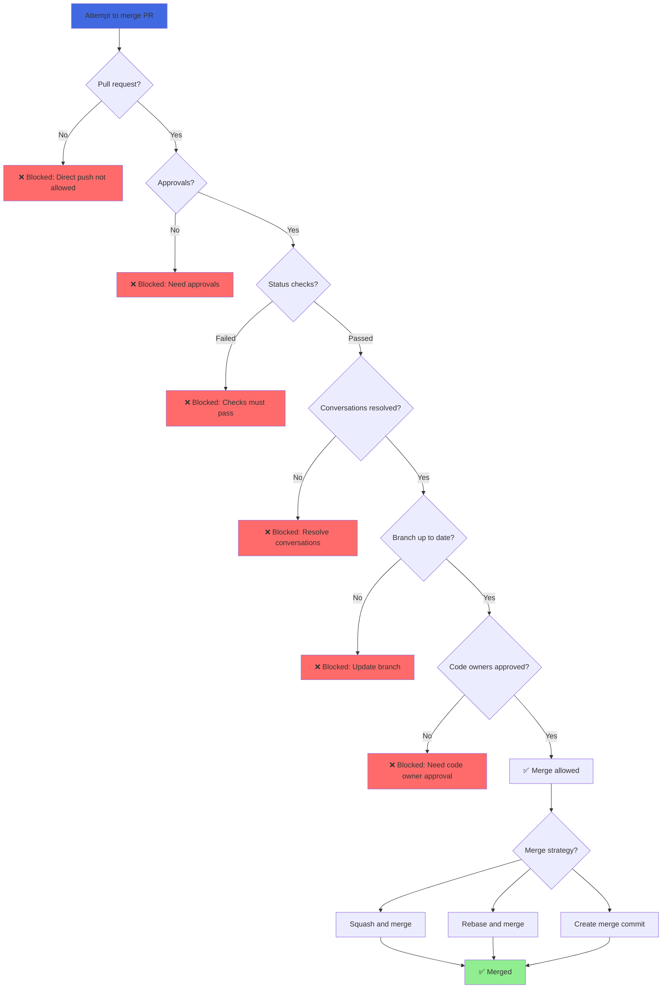
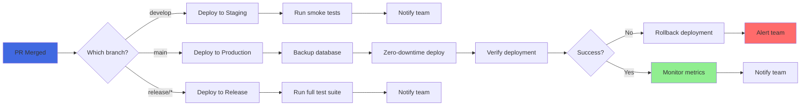
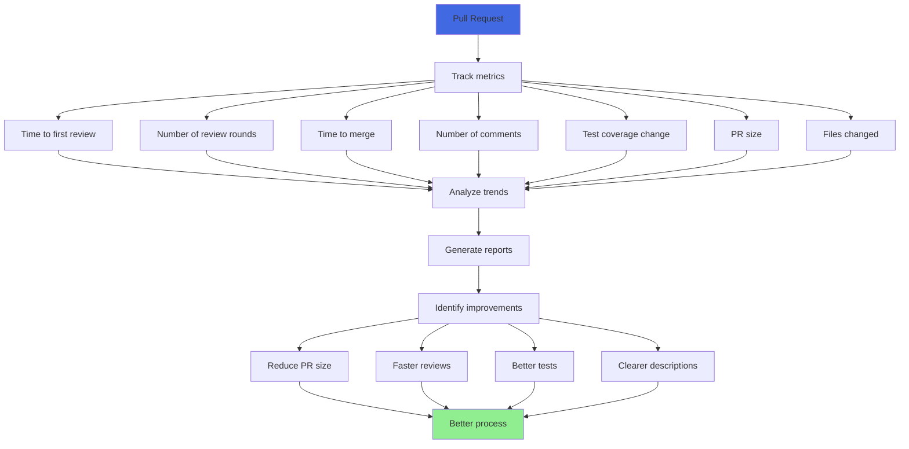

# Code Review Workflow Diagrams

Visual representations of the code review process and automation.

## 📊 Complete Pull Request Lifecycle



## 🤖 Automated Checks Flow



## 👥 CODEOWNERS Assignment Flow



## 🔄 Review Iteration Flow



## 🏷️ Auto-labeling Logic



## 🔒 Security Check Flow



## 📊 Branch Protection Flow



## 🚀 Deployment Flow (After Merge)



## 📈 Review Metrics Flow



## 🎯 Quick Reference

### PR States

```
Draft → Open → In Review → Changes Requested → Re-review → Approved → Merged
  ↓       ↓         ↓              ↓              ↓          ↓         ↓
 WIP    Checks   Reviewing    Addressing     Re-checking  Ready   Deployed
```

### Check Status

```
⏳ Pending → 🔄 Running → ✅ Passed
                      ↓
                   ❌ Failed → 🔧 Fix → 🔄 Re-run
```

### Review Status

```
👀 Review Requested → 💬 Commented → ✅ Approved
                   ↓
                🔄 Changes Requested → 🔧 Addressed → 👀 Re-review
```

---

**Note**: These diagrams represent the ideal workflow. Actual implementation may vary based on your team's needs and configuration.

For more details, see:
- [CODE_REVIEW_SETUP.md](CODE_REVIEW_SETUP.md)
- [CODE_REVIEW_GUIDELINES.md](CODE_REVIEW_GUIDELINES.md)
- [BRANCH_PROTECTION_SETUP.md](BRANCH_PROTECTION_SETUP.md)
