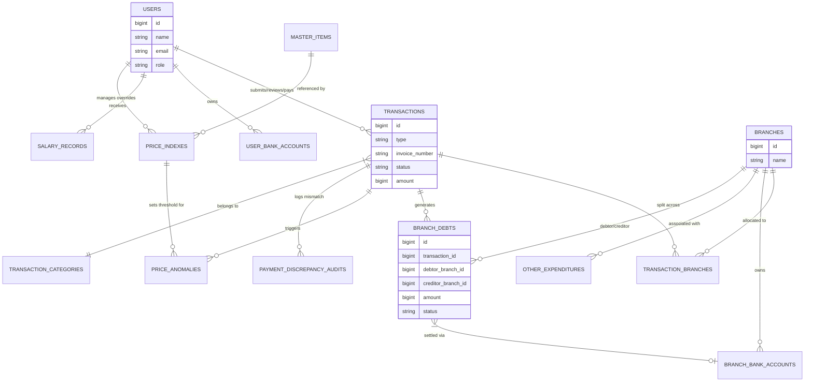

# WHUSNET Admin Payment - DATABASE SCHEMA

This document provides a comprehensive overview of the database structure for the **WHUSNET Admin Payment** project.

## Overview
The system uses a MySQL database to manage financial transactions, multi-branch allocations, inter-branch debts, and AI-powered OCR verification. The schema is designed to support a multi-role workflow (Owner, Atasan, Admin, Teknisi) and maintain a detailed audit trail.

## Database Visualization (ER Diagram)

---

## Core Tables

### `users`
Manages authentication and role-based access control.
- **id**: Primary Key
- **name**: User's full name
- **email**: Unique email address
- **password**: Hashed password
- **role**: `enum('teknisi', 'admin', 'atasan', 'owner')` (Default: `teknisi`)
- **telegram_chat_id**: ID for Telegram notifications (Nullable)
- **timestamps**: `created_at`, `updated_at`

### `branches`
Represents physical or logical business units.
- **id**: Primary Key
- **name**: Unique branch name (e.g., "Pusat", "Cabang A")
- **timestamps**: `created_at`, `updated_at`

### `transactions`
The central table for all financial activities (Rembush, Pengajuan, Gudang).
- **id**: Primary Key
- **type**: `enum('rembush', 'pengajuan', 'gudang')`
- **invoice_number**: Unique system-generated ID (e.g., `UP-202604-00001`)
- **status**: `pending`, `approved`, `waiting_payment`, `completed`, `rejected`
- **amount**: Total transaction nominal
- **category**: Transaction category (linked to `TransactionCategory`)
- **customer**: Customer/Project name (Nullable)
- **vendor**: Vendor name (Nullable)
- **description**: Detailed notes
- **submitted_by**: Foreign Key to `users.id`
- **reviewed_by**: Foreign Key to `users.id` (Management)
- **paid_by**: Foreign Key to `users.id` (Admin/Payer)
- **sumber_dana_branch_id**: Primary branch paying for the transaction
- **is_edited_by_management**: Boolean flag for version control
- **items_snapshot**: JSON blob of original technician submission
- **invoice_file_path**: Path to the uploaded invoice/nota
- **bukti_transfer**: Path to payment proof
- **OCR Fields**: `expected_total`, `actual_total`, `selisih`, `ocr_result`, `ocr_confidence`
- **timestamps**: `created_at`, `updated_at`

### `branch_debts`
Tracks inter-branch financial obligations arising from split payments.
- **id**: Primary Key
- **transaction_id**: Foreign Key to `transactions.id`
- **debtor_branch_id**: Branch that owes money
- **creditor_branch_id**: Branch that paid the amount
- **amount**: Debt nominal
- **status**: `pending`, `paid`
- **payment_method**: `transfer`, `cash`
- **payment_proof**: Path to repayment proof (Optional for cash)
- **paid_by_id**: Foreign Key to `users.id`
- **bank_account_id**: Destination bank (Foreign Key to `branch_bank_accounts.id`)
- **sender_bank_account_id**: Source bank (Foreign Key to `branch_bank_accounts.id`)
- **paid_at**: Timestamp of settlement
- **timestamps**: `created_at`, `updated_at`

---

## Support & Extension Tables

### `transaction_branches` (Pivot)
Handles multi-branch allocation for a single transaction.
- **transaction_id**: Foreign Key to `transactions.id`
- **branch_id**: Foreign Key to `branches.id`
- **allocation_percent**: Percentage of total amount (e.g., 50.00)
- **allocation_amount**: Calculated nominal for this branch

### `transaction_categories`
Categorizes transactions for reporting and filtering.
- **id**: Primary Key
- **name**: Category name (e.g., "Parkir", "Bensin")
- **code**: Short code for identification (Nullable)
- **type**: `enum('rembush', 'pengajuan')`
- **sort_order**: Integer for UI display ordering
- **is_active**: Boolean status
- **timestamps**: `created_at`, `updated_at`

### `master_items`
Standardized list of items for price consistency.
- **canonical_name**: Normalized name for matching (Unique)
- **display_name**: Human-readable name
- **category**: Item category
- **status**: `active`, `discontinued`, `pending_approval`

### `price_indexes`
Market price tracking and manual overrides.
- **master_item_id**: Foreign Key to `master_items.id`
- **item_name**: String name (for fallback matching)
- **min_price**, **max_price**, **avg_price**: Calculated from historical data
- **calculated_min_price**, **calculated_max_price**, **calculated_avg_price**: Internal system calculations
- **is_manual**: Boolean (True if management set a fixed price)
- **manual_set_by**: Foreign Key to `users.id`

### `price_anomalies`
Flags transactions exceeding market price thresholds.
- **transaction_id**: Foreign Key to `transactions.id`
- **item_name**: Name of the offending item
- **input_price**: Price submitted by technician
- **reference_max_price**: Max price from `price_indexes`
- **severity**: `low`, `medium`, `critical`
- **status**: `pending`, `reviewed`, `approved`, `rejected`

### `other_expenditures`
Standalone financial records for non-operational costs (PL- prefix).
- **invoice_number**: Unique ID (e.g., `PL-202604-00001`)
- **jenis**: `bayar_hutang`, `piutang_usaha`, `prive`
- **nominal**: Amount
- **branch_id**: Related branch
- **status**: `pending`, `approved`, `rejected`

### `salary_records`
Payroll management (GP- prefix).
- **invoice_number**: Unique ID (e.g., `GP-202604-00001`)
- **user_id**: Employee receiving salary
- **periode**: Month/Year (e.g., "Maret 2026")
- **total_gaji**: Final calculated amount
- **status**: `draft`, `approved`, `paid`

---

## Banking & Metadata

### `user_bank_accounts`
Bank details for Technicians/Admins (used for Rembush/Technician transfers).
- **user_id**: Foreign Key to `users.id`
- **bank_name**, **account_number**, **account_name**

### `branch_bank_accounts`
Official bank accounts for each branch (used for Inter-branch transfers).
- **branch_id**: Foreign Key to `branches.id`
- **bank_name**, **account_number**, **account_name**

### `payment_discrepancy_audits`
Logs every instance where OCR AI detects a mismatch between expected and actual totals.
- **transaction_id**: Foreign Key to `transactions.id`
- **selisih**: Discrepancy amount
- **resolution**: `pending`, `force_approved`, `rejected`

---

## Infrastructure & System Tables

### `activity_logs`
System-wide audit trail for all significant actions.
- **log_name**: Category of the log
- **description**: Human-readable action description
- **subject_id**, **subject_type**: Polymorphic link to the affected entity
- **causer_id**, **causer_type**: Polymorphic link to the user who performed the action
- **properties**: JSON blob of old vs. new values

### `document_sequences`
Used by `IdGeneratorService` to ensure atomic, sequential ID generation (e.g., `UP-202604-00001`) across multiple Docker containers.
- **code**: Prefix code (e.g., `UP`, `PL`, `GP`)
- **year**, **month**: Date components
- **last_value**: The last used sequence number

### `notifications`
Standard Laravel database notification store.
- **type**: Notification class name
- **notifiable_id**, **notifiable_type**: Target user
- **data**: JSON payload (message, link, etc.)
- **read_at**: Timestamp when the user viewed the notification

---

## Key Relationships Summary

1.  **Transaction Flow**:
    *   A `User` (Teknisi) submits a `Transaction`.
    *   The `Transaction` is linked to multiple `Branches` via `transaction_branches`.
    *   If a transaction is paid by one branch but allocated to others, `BranchDebt` records are automatically generated between the branches.
2.  **Price Control**:
    *   Items in a `Transaction` are checked against `PriceIndex` (which references `MasterItem`).
    *   If prices are too high, a `PriceAnomaly` is created and flagged for Management review.
3.  **Audit Trail**:
    *   Changes made by management are tracked via `is_edited_by_management` and `items_snapshot` in the `transactions` table.
    *   Every discrepancy detected by AI is logged in `payment_discrepancy_audits`.
4.  **Settlement**:
    *   `BranchDebt` records must be settled (status `paid`) before the parent `Transaction` can transition to `completed`.
    *   Repayment can be via `transfer` (requiring `branch_bank_accounts`) or `cash`.
