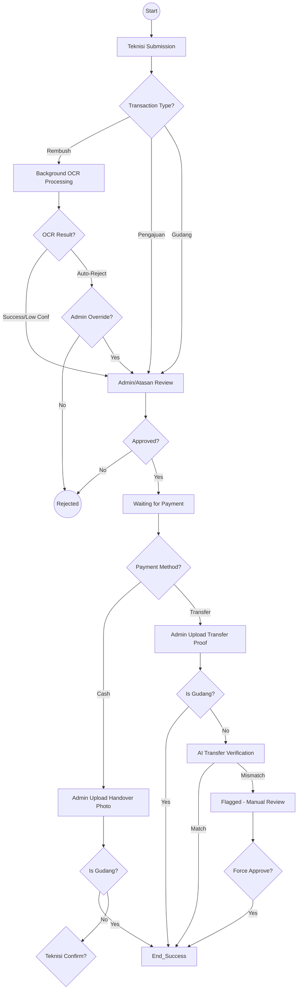
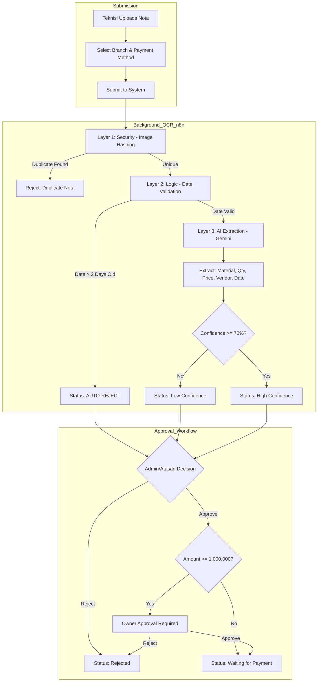
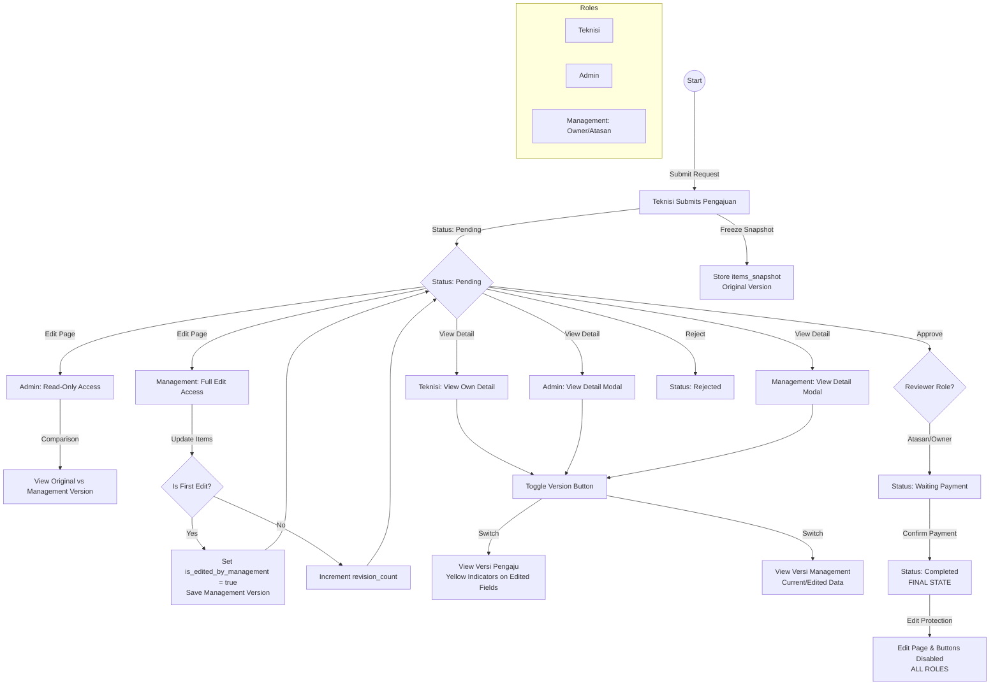
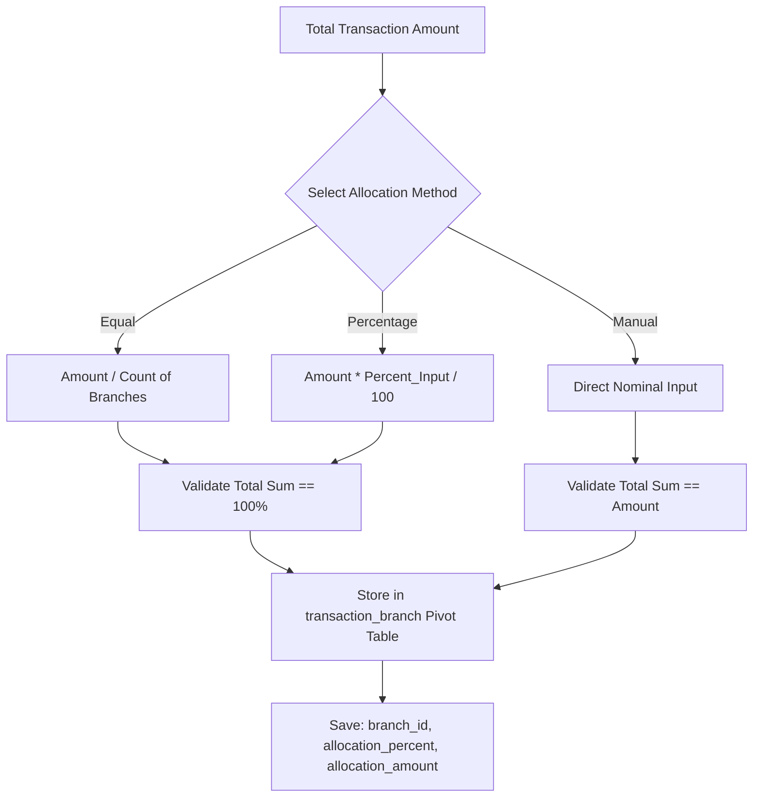
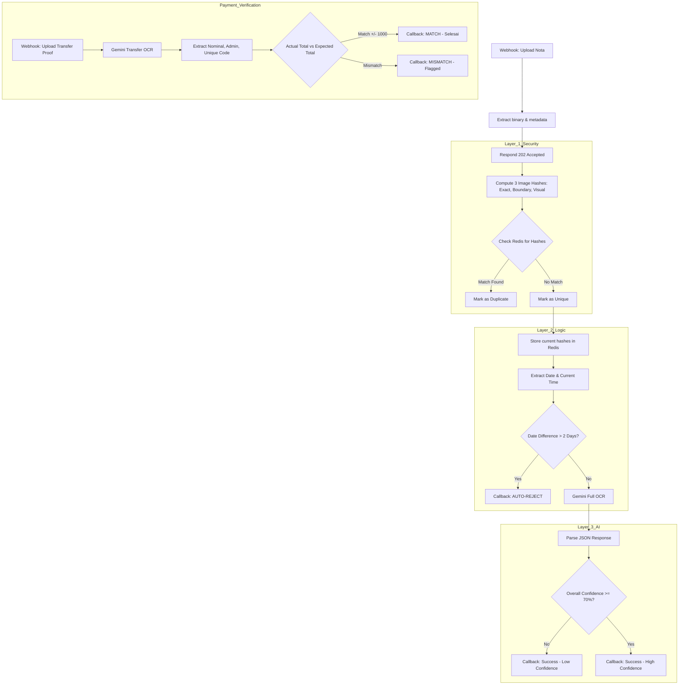
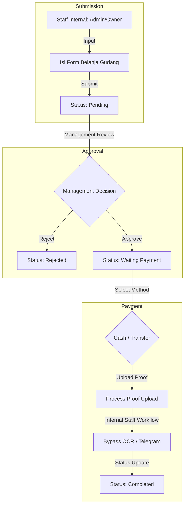

# WHUSNET Admin Payment - Flowcharts

This document provides a comprehensive overview of the system workflows, including reimbursement (Rembush), purchase requests (Pengajuan), branch allocation, and the AI-powered background OCR processing.

---

## 1. System Overview Flowchart
This flowchart describes the high-level lifecycle of a transaction from submission to completion.

---

## 2. Rembush Flowchart (with OCR Integration)
Detailed flow for reimbursements, integrating the multi-layer OCR verification logic.

---

## 3. Pengajuan Flowchart (Purchase Request)
Detailed flow for purchase requests featuring the Dual-Version System and role-based edit protections.

---

## 4. Branch Allocation Flowchart
Describes how transaction costs are distributed among different branches.

---

## 5. Background OCR Processing Flowchart
Detailed logic executed by n8n as per `OCR_Nota_Kontan_v4.5.json`.

---

## 6. Gudang Flowchart (Internal Warehouse)
Simplified flow for internal warehouse expenditures that bypasses external verification requirements.

