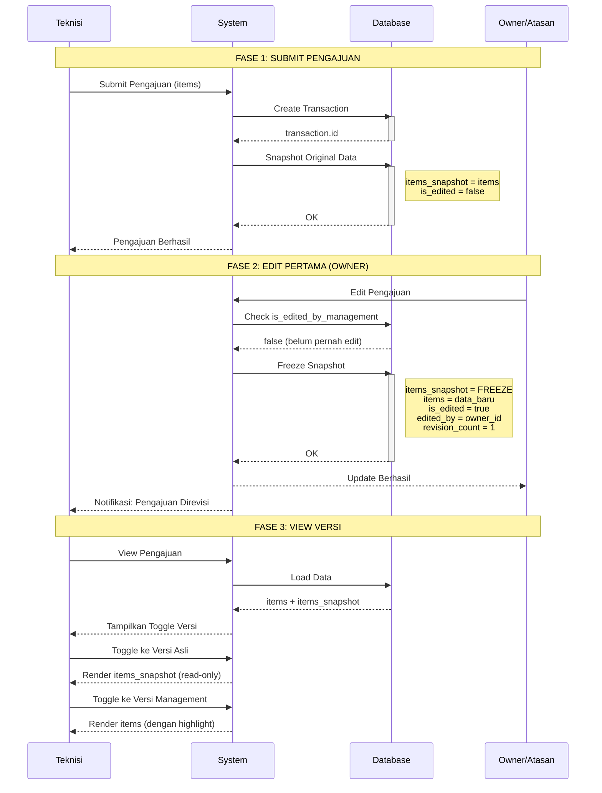
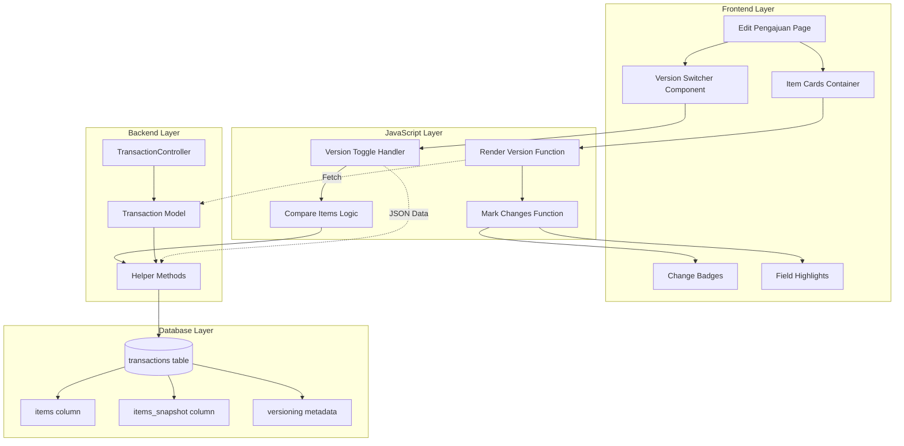
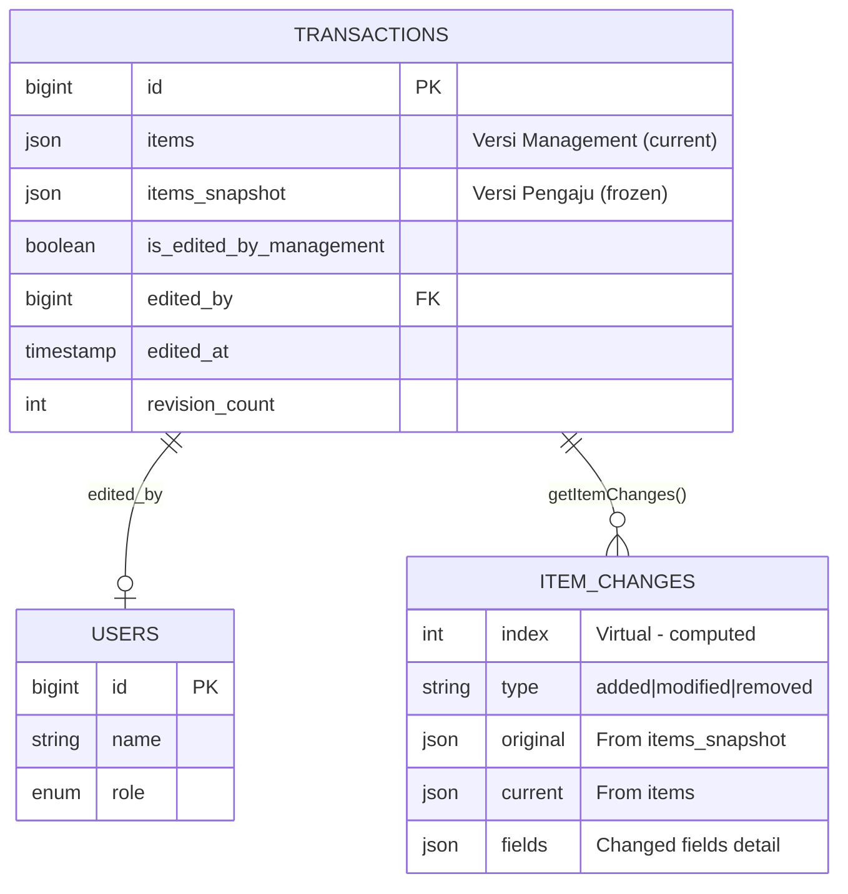
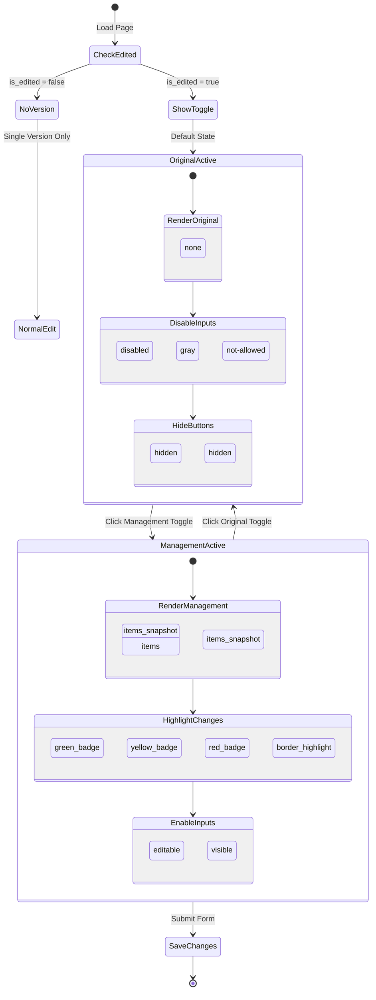
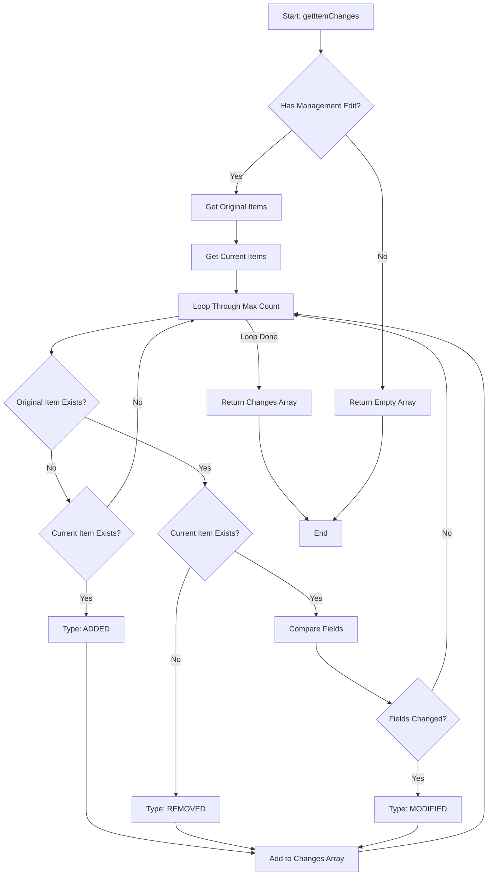
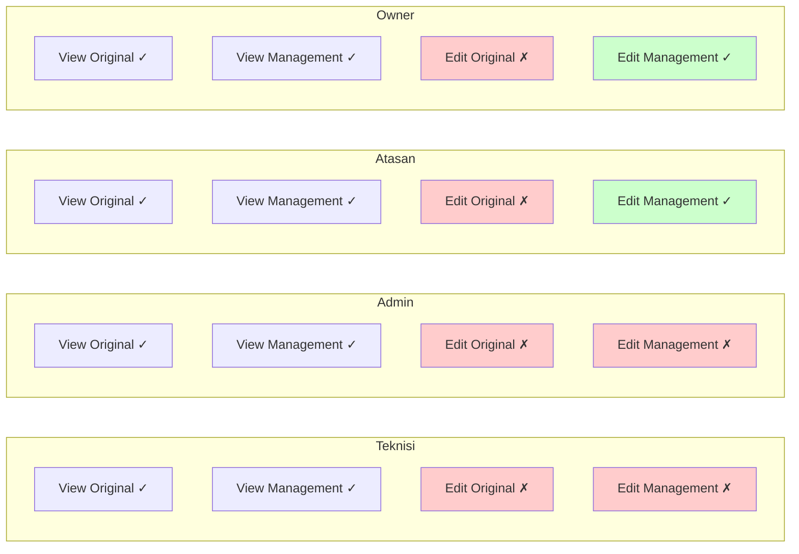

# Dual Version System - Flow Diagrams

## 1. Data Flow Sequence



---

## 2. State Machine

```mermaid
stateDiagram-v2
    [*] --> Draft: Teknisi Create
    Draft --> Submitted: Submit Pengajuan
    
    state Submitted {
        [*] --> Original
        Original --> Original: View Only
        
        state "Versi Pengaju" as Original {
            items_snapshot: Data Asli
            editable: false
        }
    }
    
    Submitted --> FirstEdit: Owner/Atasan Edit
    
    state FirstEdit {
        [*] --> FreezeSnapshot
        FreezeSnapshot --> UpdateItems
        UpdateItems --> MarkEdited
        
        state MarkEdited {
            is_edited: true
            edited_by: owner_id
            revision_count: 1
        }
    }
    
    FirstEdit --> Revised
    
    state Revised {
        [*] --> DualVersion
        
        state DualVersion {
            state fork_state <<fork>>
            [*] --> fork_state
            fork_state --> VOriginal: Toggle
            fork_state --> VManagement: Toggle
            
            state "Versi Pengaju (Frozen)" as VOriginal {
                source: items_snapshot
                editable: false
                badge: none
            }
            
            state "Versi Management" as VManagement {
                source: items
                editable: true (Owner/Atasan)
                badge: changes highlighted
            }
            
            VOriginal --> fork_state
            VManagement --> fork_state
        }
    }
    
    Revised --> SubsequentEdit: Edit Lagi
    
    state SubsequentEdit {
        [*] --> KeepSnapshot
        KeepSnapshot --> UpdateItems2
        UpdateItems2 --> IncrementRevision
        
        state KeepSnapshot {
            items_snapshot: UNCHANGED
        }
        
        state IncrementRevision {
            revision_count: +1
        }
    }
    
    SubsequentEdit --> Revised
    
    Revised --> [*]: Approved/Completed
```

---

## 3. Component Architecture



---

## 4. Data Structure



---

## 5. UI State Flow



---

## 6. Change Detection Algorithm



---

## 7. Permission Matrix



---

**Legend:**
- ✓ = Allowed
- ✗ = Forbidden
- 🟢 Green = Editable
- 🔴 Red = Read-only
