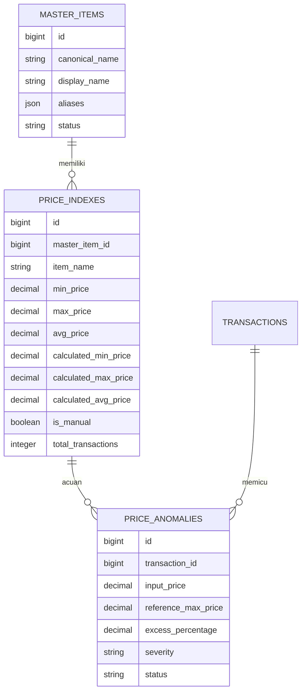
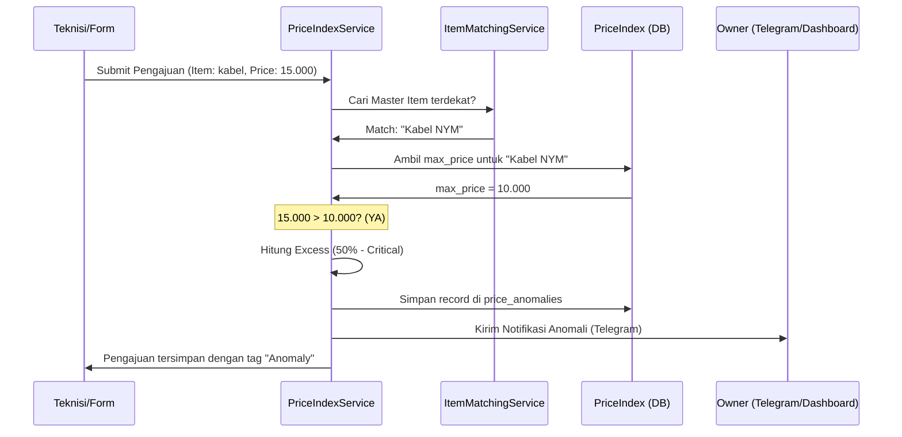

# 🏢 Price Index System - Documentation

Price Index System adalah subsistem pada aplikasi **WHUSNET Admin Payment** yang berfungsi untuk mengelola referensi harga barang secara otomatis, mendeteksi anomali harga pada pengajuan teknisi, dan memberikan kontrol penuh kepada Owner/Atasan untuk menjaga efisiensi anggaran perusahaan.

---

## 📋 Daftar Isi
1. [Fitur Utama](#-fitur-utama)
2. [Struktur Project](#-struktur-project)
3. [Modul Aplikasi](#-modul-aplikasi)
4. [Route (Web & API)](#-route-web--api)
5. [Perintah Berguna (Artisan)](#-perintah-berguna-artisan)
6. [Database Schema](#-database-schema)
7. [Dokumentasi Lanjutan & Alur](#-dokumentasi-lanjutan--alur)
    - [Alur Deteksi Anomali](#alur-deteksi-anomali)
    - [Status Sumber (Review, Auto, Manual)](#status-sumber-review-auto-manual)
    - [Logika Perhitungan IQR (Outlier Detection)](#logika-perhitungan-iqr-outlier-detection)
    - [Weighted Average Logic](#weighted-average-logic)

---

## ✨ Fitur Utama

1.  **Smart Autocomplete (Master Item Catalog):**
    - Mengatur standarisasi nama barang melalui catalog sentral (`master_items`).
    - Menggunakan strategi 3-level matching (Exact -> Alias -> Fuzzy Match via FULLTEXT Index).
    - Mempermudah teknisi dalam mengisi form pengajuan dengan saran nama barang yang sudah ada.

2.  **Auto-Calculated Price Index:**
    - Menghitung secara otomatis harga **Minimum**, **Maximum**, dan **Rata-rata** berdasarkan histori transaksi yang telah di-approve.
    - Menggunakan metode **IQR (Interquartile Range)** untuk membuang data outlier (harga yang tidak wajar di histori) sebelum dihitung.

3.  **Real-Time Anomaly Detection:**
    - Memberikan peringatan instan saat teknisi memasukkan harga yang melebihi batas `max_price` referensi.
    - Klasifikasi tingkat keparahan (Severity):
        - **Low:** < 20% selisih.
        - **Medium:** 20% - 50% selisih.
        - **Critical:** > 50% selisih.

4.  **Manual Override & Reference Setting:**
    - Owner/Atasan dapat men-set harga dari transaksi tertentu sebagai "Harga Referensi Utama" yang mengunci sistem perhitungan otomatis.
    - **Dual-Tracking System:** Sistem tetap menghitung harga pasar otomatis (Auto) di latar belakang meskipun status "Manual" aktif.
    - **Reset to Auto:** Fitur untuk mengembalikan kontrol harga ke sistem otomatis dengan satu klik.
    - Mendukung catatan alasan (`manual_reason`) untuk setiap perubahan manual.

5.  **Analytics & Reporting:**
    - Dashboard tren harga barang.
    - Ekspor data Price Index ke format CSV untuk analisis offline.

---

## 🏗️ Struktur Project

Berikut adalah file-file penting yang menyusun sistem Price Index:

### Controllers
- `App\Http\Controllers\PriceIndexController`: Menangani CRUD Dashboard, Review Anomali, dan Analytics.
- `App\Http\Controllers\Api\ItemAutocompleteController`: Endpoint untuk pencarian autocomplete Master Item.

### Services (Core Logic)
- `App\Services\PriceIndex\PriceIndexService`: Otak utama untuk deteksi anomali, kalkulasi index, dan manual override.
- `App\Services\PriceIndex\ItemMatchingService`: Menangani pencarian barang menggunakan logika fuzzy matching dan canonical naming.

### Models
- `App\Models\MasterItem`: Tabel master catalog barang.
- `App\Models\PriceIndex`: Tabel penyimpan referensi harga (min/max/avg).
- `App\Models\PriceAnomaly`: Log pencatatan saat terjadi input harga tidak wajar.

### Jobs (Background Processing)
- `App\Jobs\PriceIndex\CalculatePriceIndexJob`: Menghitung ulang index per item secara asinkron.
- `App\Jobs\PriceIndex\BatchCalculatePriceIndexJob`: Menghitung ulang seluruh index (bulk).
- `App\Jobs\PriceIndex\SendPriceAnomalyNotificationJob`: Mengirimkan notifikasi (Telegram).

---

## 🧩 Modul Aplikasi

Sistem ini terintegrasi di beberapa modul utama:

1.  **Modul Pengajuan (Teknisi):**
    - Terintegrasi di `resources/views/transactions/form-pengajuan.blade.php`.
    - Saat mengisi nama barang, sistem memanggil `ItemAutocompleteController`.
    - Tombol "Min", "Max", "Avg" muncul otomatis jika barang ditemukan di Price Index.

2.  **Modul Approval (Owner/Atasan):**
    - Terintegrasi di `resources/views/transactions/show.blade.php`.
    - Memberikan indikator warna jika ada anomali harga.
    - Tombol "Jadikan Referensi" untuk mengunci harga barang tersebut ke sistem Index.

3.  **Price Index Management Dashboard:**
    - Halaman khusus untuk monitoring seluruh daftar index barang.
    - Review Center untuk melihat daftar anomali yang butuh tindak lanjut.

---

## 🛣️ Route (Web & API)

Daftar route utama sistem Price Index:

| Method | Endpoint | Name | Function |
| :--- | :--- | :--- | :--- |
| `GET` | `/price-index` | `price-index.index` | Daftar Price Index |
| `GET` | `/api/price-index/lookup` | `price-index.lookup` | Cari harga referensi (API) |
| `GET` | `/api/items/autocomplete` | `items.autocomplete` | Autocomplete Master Item |
| `POST`| `/price-index/anomalies/{id}/review` | `price-index.anomalies.review` | Review anomali harga |
| `POST`| `/price-index/set-reference/{transaction}` | `price-index.set-reference` | Set harga transaksi jadi ref |
| `POST`| `/price-index/{id}/reset-auto` | `price-index.reset-auto` | Reset manual ke mode Auto |
| `GET` | `/price-index/analytics` | `price-index.analytics` | Dashboard Analitik |
| `GET` | `/price-index/analytics/export` | `price-index.export-csv` | Ekspor CSV |

---

## 💻 Perintah Berguna (Artisan)

Gunakan perintah ini di terminal untuk manajemen data Price Index:

```bash
# Menghitung ulang seluruh Price Index dari histori transaksi
php artisan price-index:recalculate

# Sinkronisasi Master Item dari data yang sudah ada
php artisan items:populate
```

---

## 🗄️ Database Schema

### ERD Sederhana


---

## 🔄 Dokumentasi Lanjutan & Alur

### Alur Deteksi Anomali
Alur ini terjadi saat Teknisi menekan tombol simpan pada pengajuan:



### Status Sumber (Review, Auto, Manual)

Sistem menggunakan tiga status untuk membedakan tingkat kepercayaan dan cara pembaruan data:

| Status | Warna | Deskripsi | Perilaku Pembaruan |
| :--- | :--- | :--- | :--- |
| **Review** | Merah | Barang baru ditemukan (Cold Start) | Butuh persetujuan manual pertama kali dari Owner/Atasan. |
| **Auto** | Biru | Data terverifikasi dari histori transaksi | **Dinamis:** Harga mengikuti perkembangan pasar dan diperbarui otomatis tiap ada transaksi baru. |
| **Manual** | Ungu | Harga dikunci oleh Management | **Statis:** Harga tidak berubah meskipun pasar bergejolak. Tetap melacak "Harga Sistem" di latar belakang. |

**Transisi Status:**
- `Review` ➔ `Auto`: Saat Owner menyetujui harga atau klik "Jadikan Referensi".
- `Auto` ➔ `Manual`: Saat Owner mengedit harga secara manual di Dashboard.
- `Manual` ➔ `Auto`: Saat Owner menekan tombol **"Reset ke Auto"** di modal Edit.

---

### Logika Perhitungan IQR (Outlier Detection)

Sebelum menghitung rata-rata harga, sistem membuang data yang dianggap "tidak wajar" (contoh: salah input nol lebih satu) menggunakan metode IQR (Interquartile Range) 1.5x rule.

**Script Logic (`PriceIndexService.php`):**
```php
private function removeOutliers(array $prices): array
{
    if (count($prices) < 4) {
        return $prices; // Tidak cukup data untuk IQR
    }

    sort($prices);
    $count = count($prices);

    // Hitung Q1 (25th percentile) dan Q3 (75th percentile)
    $q1 = $prices[(int) floor(($count - 1) / 4)];
    $q3 = $prices[(int) ceil(($count - 1) * 3 / 4)];
    $iqr = $q3 - $q1;

    // Tentukan batas bawah dan batas atas
    $lowerBound = $q1 - 1.5 * $iqr;
    $upperBound = $q3 + 1.5 * $iqr;

    // Filter data yang berada di dalam jangkauan wajar saja
    return array_values(array_filter($prices, fn($p) => $p >= $lowerBound && $p <= $upperBound));
}
```

### Weighted Average Logic

Data terbaru memiliki bobot lebih tinggi dalam menentukan `avg_price` untuk beradaptasi dengan inflasi atau perubahan harga pasar.

**Formula:**
`avg_price = ∑(price * weight) / ∑(weight)`
Di mana `weight = 1 / (1 + age_in_months)`

Dengan sistem ini, harga yang di-approve 1 bulan lalu lebih berpengaruh daripada harga yang di-approve 6 bulan lalu.

---

> [!TIP]
> **Tips Standarisasi:** Selalu arahkan teknisi untuk memilih barang dari dropdown autocomplete agar data Price Index tetap akurat dan tidak terpecah karena perbedaan penulisan (typo).
