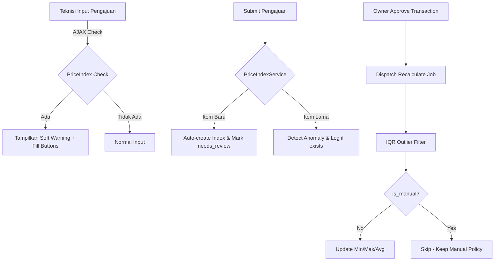
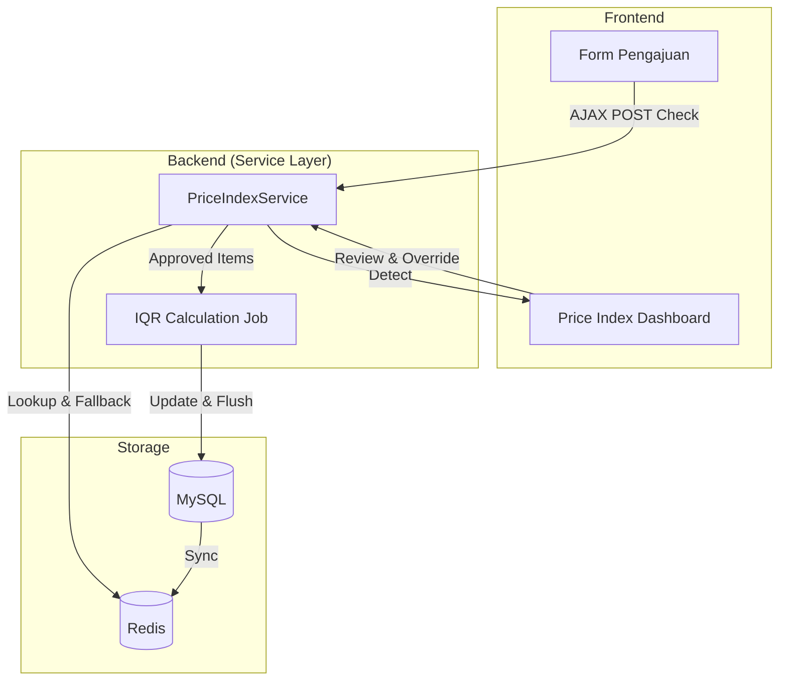

# 🏛️ WHUSNET Price Index System

Dokumentasi ini memberikan gambaran mendalam mengenai arsitektur sistem, alur data, dan logika perhitungan pada aplikasi **WHUSNET Admin Payment**, khusus untuk modul **Price Index** dan **Deteksi Anomali**.

---

## 1. 📁 Struktur Folder & Arsitektur

Sistem ini dibangun menggunakan framework **Laravel 12** dengan pola arsitektur **MVC (Model-View-Controller)** yang diperkuat dengan **Service Layer** untuk memisahkan logika bisnis dari kontroler.

### 🌳 Tree Structure (High-Level)
```text
app/
### 🌳 Tree Structure (High-Level)
```text
app/
├── Http/
│   ├── Controllers/          # Handler HTTP Request & Response
│   │   ├── PriceIndexController.php    # Dashboard & Master Data Price Index (Standardized)
│   │   ├── PengajuanController.php     # Logika pendaftaran pengajuan barang (Manual)
│   │   └── TransactionController.php   # Manajemen status & persetujuan umum
├── Models/                   # Representasi Database & Relasi
│   ├── Transaction.php       # Inti data transaksi (Rembush/Pengajuan)
│   ├── PriceIndex.php        # Master data referensi harga (with Audit Trail)
│   └── PriceAnomaly.php      # Pencatatan deteksi harga tidak wajar
├── Services/                 # Business Logic Layer
│   └── PriceIndex/
│       └── PriceIndexService.php  # Engine perhitungan, IQR Filter, & Cold Start logic
├── Jobs/                     # Background Processes (Queue)
│   └── PriceIndex/
│       ├── CalculatePriceIndexJob.php      # Recalculate single item
│       ├── BatchCalculatePriceIndexJob.php # Optimized batch recalculation
│       └── SendPriceAnomalyNotificationJob.php
database/
├── migrations/               # Schema database (including manual_reason & needs_initial_review)
└── seeders/                  # Data awal untuk testing
```

### 🔗 Hubungan Antar Module
- **Cold Start**: Jika item baru diajukan, `PriceIndexService` otomatis membuat record dengan flag `needs_initial_review`.
- **Real-time Check**: Form pengajuan memanggil `PriceIndexController@check` via AJAX POST untuk validasi instan.
- **Audit Trail**: Setiap perubahan manual di `PriceIndex` wajib menyertakan `manual_reason`.
- **Incremental Recalculation**: Job dipicu saat transaksi diapprove untuk memperbarui index tanpa membebani performa.

---

## 2. 🔄 Alur Price Index (Flow)

Sistem Price Index bekerja secara dinamis untuk memastikan harga yang diajukan teknisi tetap kompetitif dan sesuai riwayat pasar.



---

## 3. 🧮 Perhitungan Price Index

Sistem tidak hanya mengambil rata-rata mentah, tetapi menggunakan metode statistik untuk menghindari dispersi data akibat data pencilan (outliers).

### 🔢 Rumus & Langkah Perhitungan
Perhitungan dilakukan secara *lazy* (incremental) via background jobs.

1.  **Pencarian Data**: Me-retrieve histori harga item yang berstatus `approved` atau `completed`.
2.  **Category Fallback**: Jika item spesifik belum ada, sistem mengambil rata-rata harga dari kategori yang sama sebagai referensi sementara.
3.  **Pembersihan Data (IQR Method)**: 
    - Hitung **Quartile 1 (Q1)** dan **Quartile 3 (Q3)**.
    - **IQR** = $Q3 - Q1$.
    - **Upper Bound** = $Q3 + (1.5 \times IQR)$.
    - **Lower Bound** = $Q1 - (1.5 \times IQR)$.
4.  **Agregasi**:
    - `min_price`: Nilai terendah data bersih.
    - `max_price`: Nilai tertinggi data bersih.
    - `avg_price`: Rata-rata ($\bar{x}$) dari data bersih.

> [!TIP]
> **Manual Override**: Jika Owner mengeset harga secara manual (`is_manual = true`), sistem tidak akan melakukan auto-calculate pada item tersebut untuk menjaga stabilitas kebijakan harga.

---

## 4. 🗄️ Dokumentasi Database Schema

### Table: `price_indexes` (Master Referensi)
| Column | Type | Description |
| :--- | :--- | :--- |
| `item_name` | VARCHAR | Nama barang (Unique with category) |
| `category` | VARCHAR | Kategori (Indexed for fallback logic) |
| `min_price` | DECIMAL | Harga terendah (Cleaned) |
| `avg_price` | DECIMAL | Harga rata-rata pasar internal |
| `max_price` | DECIMAL | Batas anomali (Reference Point) |
| `is_manual` | BOOLEAN | Lock flag untuk kebijakan Owner |
| `manual_reason`| TEXT | Audit trail alasan override manual |
| `needs_initial_review` | BOOL | Flag item baru (Cold Start) |
| `total_transactions` | INT | Jumlah sample data yang digunakan |
| `last_calculated_at` | TS | Timestamp kalkulasi terakhir |

### Table: `price_anomalies` (Log Pelanggaran)
| Column | Type | Description |
| :--- | :--- | :--- |
| `transaction_id` | FK | Relasi ke `transactions.id` |
| `item_name` | VARCHAR | Nama barang saat kejadian |
| `input_price` | DECIMAL | Harga yang diinput teknisi |
| `reference_max_price` | DECIMAL | Harga referensi saat kejadian |
| `excess_amount` | DECIMAL | Nominal kelebihan harga |
| `excess_percentage` | FLOAT | Persentase kelebihan |
| `severity` | ENUM | low, medium, critical |
| `status` | ENUM | pending, reviewed, approved, rejected |

### 📂 ERD Deskriptif (Relasi)
- **Transaction (1) <---> (N) PriceAnomaly**: Satu transaksi dapat memicu banyak anomali tergantung jumlah item di dalamnya.
- **PriceIndex (1) <---> (N) PriceAnomaly**: Satu master index merekam sejarah pelanggaran harga untuk item tersebut melalui nama item.
- **User (1) <---> (N) PriceIndex**: Melalui `manual_set_by`, mencatat siapa Owner/Atasan yang melakukan override manual.

---

## 5. 🚨 Flow Deteksi Anomali

Deteksi anomali bersifat **Rule-Based** dengan parameter statistik dari data historis.

### 🚩 Trigger & Kondisi
- **Trigger**: AJAX `onchange` di form pengajuan dan server-side `detectForTransaction`.
- **Kondisi**: `Input Price > Reference Max Price`.

### 📊 Klasifikasi Severity
Sistem memberikan label tingkat bahaya berdasarkan persentase kelebihan harga:
- **🔴 Critical**: Selisih **≥ 50%**. Notifikasi High-Priority.
- **🟠 Medium**: Selisih **20% - 49%**.
- **🟡 Low**: Selisih **< 20%**.

---

## ⚙️ Teknologi yang Digunakan

| Komponen | Teknologi | Peran |
| :--- | :--- | :--- |
| **Queue Engine** | Laravel Horizon | Manajemen batch recalculation (Redis). |
| **Real-time UI** | Laravel Reverb | Update dashboard & badges tanpa refresh. |
| **Data Engine** | PHP 8.4 + SQL | Kalkulasi statistik IQR & locking database. |
| **Notification** | Telegram Bot | Alert anomali harga langsung ke manajemen. |

---

## 🔁 Flowchart Integrasi Sistem



---
**Document Status**: `FINAL` | **Author**: Senior Architect & Technical Writer Agent
