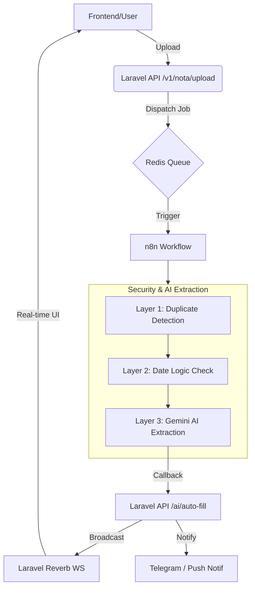

# 🏢 WHUSNET Admin Payment

> Sistem manajemen keuangan internal untuk **WHUSNET** — mengelola transaksi rembush (reimbursement) & pengajuan pembelian, dengan fitur **OCR otomatis** menggunakan AI (Gemini via n8n), alur approval multi-level, serta dashboard analitik real-time.

---

## 📋 Daftar Isi

- [Fitur Utama](#-fitur-utama)
- [Tech Stack](#-tech-stack)
- [Arsitektur Sistem](#-arsitektur-sistem)
- [Alur Kerja (Workflows)](#-alur-kerja-workflows)
- [Peran Pengguna (Roles) & Detail Akses](#-peran-pengguna-roles--detail-akses)
- [OCR & Security Layers](#-ocr--security-layers)
- [Integrasi Telegram](#-integrasi-telegram)
- [Struktur Project](#-struktur-project)
- [Instalasi & Setup](#-instalasi--setup)
- [Database & ID Strategy](#-database--id-strategy)

---

## ✨ Fitur Utama

| Fitur | Deskripsi |
|---|---|
| **Rembush (Reimbursement)** | Flow otomatis: Upload nota → **3-Layer Security** (Duplikat, Tanggal, AI) → Auto-fill data → Submit. |
| **Pengajuan Pembelian** | Pengajuan barang/jasa tanpa OCR. Mendukung upload foto pendukung dan alokasi cabang manual. |
| **OCR AI (Gemini Pro)** | Ekstraksi data tingkat tinggi menggunakan n8n + Gemini Pro 1.5/2.0 (Logic & Extraction). |
| **Multi-Tier Approval** | Hierarki persetujuan: Admin → Atasan Spesifik → Owner. Wajib Owner Approval untuk transaksi ≥ Rp 1.000.000. |
| **Dual Payment Verification** | **Transfer**: Diverifikasi AI (Gemini) untuk nominal match. **Cash**: Konfirmasi manual oleh Teknisi via Telegram. |
| **Bypass AI Control** | Fitur **Override** (untuk memulihkan *auto-reject*) dan **Force Approve** (untuk memulihkan *flagged* nominal). |
| **Telegram Bot Sync** | Notifikasi real-time, konfirmasi pembayaran cash, dan alert selisih nominal langsung ke Telegram. |
| **Real-time Monitoring** | Integrasi Laravel Reverb untuk update status OCR dan dashboard tanpa refresh. |
| **Activity Log & Audit** | Audit trail lengkap untuk setiap aksi dan laporan kebocoran dana bulanan via `PaymentDiscrepancyAudit`. |

---

## 🛠 Tech Stack

### Backend & Core
- **PHP 8.4** & **Laravel 12**
- **MySQL 8.0** — Database relasional dengan skema audit & discrepancy tracking.
- **Redis 7.2** — Driver utama untuk cache, queue, session, dan **Atomic ID Generator**.
- **Laravel Reverb** — WebSocket server untuk real-time updates.
- **Laravel Horizon** — Monitoring background jobs (OCR, Telegram, Notifications).

### Frontend
- **Blade Templates** — Server-side rendering dengan logic role-based.
- **Tailwind CSS v4** — Modern utility-first CSS framework.
- **Vite** — Asset bundling & HMR.
- **Vanilla JS & Axios** — AJAX interactions & real-time UI synchronization.

---

## 🏗 Arsitektur Sistem



---

## 🔄 Alur Kerja (Workflows)

### 1. Rembush (OCR Flow)
1. **Upload**: User upload foto nota.
2. **Security Check**: Sistem mengecek duplikasi (L1) dan validitas tanggal (L2).
3. **AI Extraction**: Gemini mengekstrak Vendor, Item, dan Nominal (L3).
4. **Fulfillment**: User melengkapi kategori dan alokasi cabang.
5. **Approval**: Admin/Atasan menyetujui. Jika ≥ 1 Jt, lanjut ke Owner.
6. **Payment**: Admin upload bukti bayar.
7. **Verification**: 
   - **Transfer**: AI mengecek nominal bukti vs nominal transaksi.
   - **Cash**: Teknisi konfirmasi terima uang via Telegram.

### 2. Pengajuan (Manual Flow)
1. **Input**: User input detail pengajuan (Vendor, Specs, Est. Price).
2. **Approval**: Sama dengan flow Rembush.
3. **Payment & Finish**: Admin bayar dan transaksi selesai.

---

## 👥 Peran Pengguna (Roles) & Detail Akses

| Role | Dashboard | Input | Approval | Bypass/Force | Master Data |
|---|:---:|:---:|:---:|:---:|:---:|
| **Owner** | Full | ✅ | ✅ Final (All) | ✅ | ✅ All |
| **Atasan** | Partial | ❌ | ✅ Assigned | ❌ | ✅ User (Level Teknisi) |
| **Admin** | Full | ✅ | ✅ < 1 Jt / Assign | ✅ | ✅ User & Branch |
| **Teknisi** | ❌ | ✅ | ❌ | ❌ | ❌ |

---

## 🛡️ OCR & Security Layers

Sistem menerapkan **4-Layer Verification** untuk menjamin validitas keuangan:
1. **Layer 1 (Duplicate)**: Pengecekan MD5 hash file nota di Redis/DB.
2. **Layer 2 (Date Logic)**: Nota berumur > 2 hari kalender otomatis berstatus `auto-reject`.
3. **Layer 3 (AI Extraction)**: Gemini Pro mengekstrak data dengan parameter `confidence`.
4. **Layer 4 (Payment Audit)**: Verifikasi nominal pada struk transfer. Jika selisih, status menjadi `flagged`.

---

## 🤖 Integrasi Telegram

Bot Telegram digunakan sebagai jembatan komunikasi real-time:
- **Teknisi**: Menerima notifikasi pembayaran cash dan tombol **✅ Konfirmasi Terima**.
- **Admin/Owner**: Menerima alert **🚨 Selisih Nominal** atau **⛔ Auto-Reject**.
- **Owner**: Menerima notifikasi untuk **Force Approve** pada transaksi yang di-flag.
- **Broadcast**: Pengiriman pesan ke seluruh staf atau role tertentu.

---

## 📂 Struktur Project

```text
Admin-Payment/
├── app/
│   ├── Http/Controllers/
│   │   ├── Api/             # Webhook n8n, Telegram, & Polling
│   │   ├── RembushController # Logic khusus OCR & Nota
│   │   └── TransactionController # Core Business Logic (Approval)
│   ├── Services/
│   │   ├── Telegram/        # TelegramBotService & Logic
│   │   ├── OCR/             # Rate Limiter & AI Config
│   │   └── IdGeneratorService # Sequential ID Engine (Redis)
│   ├── Models/
│   │   ├── Transaction      # Entity utama & Status Management
│   │   └── PaymentDiscrepancyAudit # Log selisih nominal AI
│   └── Jobs/
│       └── OcrProcessingJob # Background Trigger ke n8n
├── database/migrations/      # Schema (Users, TRX, Audits, Banks)
├── routes/
│   ├── web.php              # Auth-protected Admin routes
│   └── api.php              # Webhook & Public API (X-SECRET)
└── docker-compose.yml        # 9 Services Infrastructure
```

---

## 🚀 Instalasi & Setup

1. **Clone & Env**: `cp .env.example .env` (Konfigurasi Redis & n8n Secret).
2. **Build**: `docker-compose up -d --build`.
3. **Setup**:
   ```bash
   docker exec -it whusnet-app composer install
   php artisan migrate --seed
   php artisan storage:link
   ```
4. **Run**: `composer run dev` (Menjalankan Vite, Queue, dan Server).

---

## 📊 Database & ID Strategy

### ID Generation
Mencegah duplikasi ID saat high-concurrency menggunakan Redis:
- **Upload ID**: `UP-YYYYMMDD-XXXXX`
- **Invoice**: `INV-YYYYMMDD-XXXXX`
- **Trace ID**: `TRX-XXXXXXXX`

### Audit Trail
Setiap tindakan krusial (Override, Force Approve, Status Change) tercatat di `activity_logs` dan `payment_discrepancy_audits` untuk akuntabilitas.

---

## 🎨 Dokumentasi Lanjutan

- ⚙️ **[Back-End Documentation](backend_documentation_v1.0.md)**: Arsitektur, Skema DB, dan Security.
- 🎨 **[Front-End Documentation](frontend_documentation_v1.0.md)**: UI/UX, Component, dan Real-time WS.
- 📡 **[API Documentation](api_documentation_v4.5.md)**: Webhook n8n, Telegram, dan Endpoint Flow.
