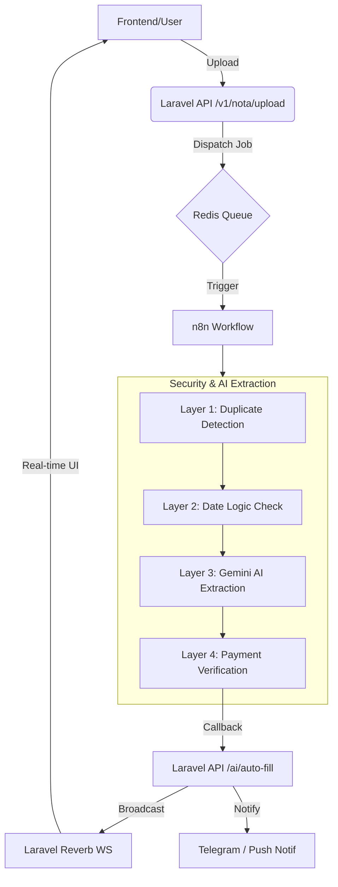

# 🏢 WHUSNET Admin Payment

> Sistem manajemen keuangan internal untuk **WHUSNET** — mengelola transaksi rembush (reimbursement) & pengajuan pembelian, dengan fitur **OCR otomatis** menggunakan AI (Gemini via n8n), alur approval multi-level, serta dashboard analitik real-time.

---

## 📋 Daftar Isi

- [Fitur Utama](#-fitur-utama)
- [Tech Stack](#-tech-stack)
- [Arsitektur Sistem](#-arsitektur-sistem)
- [Persyaratan](#-persyaratan)
- [Instalasi & Setup](#-instalasi--setup)
- [Konfigurasi Environment](#-konfigurasi-environment)
- [Struktur Project](#-struktur-project)
- [Peran Pengguna (Roles)](#-peran-pengguna-roles)
- [Modul Aplikasi](#-modul-aplikasi)
- [Alur Transaksi](#-alur-transaksi)
- [API Endpoints](#-api-endpoints)
- [Event & Notifikasi](#-event--notifikasi)
- [Perintah Berguna](#-perintah-berguna)

---

## ✨ Fitur Utama

| Fitur | Deskripsi |
|---|---|
| **Rembush (Reimbursement)** | Flow otomatis: Upload nota → 4-Layer Security (Duplikat, Tanggal, AI, Payment Verification) → Auto-fill data → Submit. |
| **Pengajuan Pembelian** | Sistem **Dual-Version** (Teknisi vs Management). Mendukung perbandingan versi, snapshot items, dan alokasi cabang manual. |
| **OCR AI (Gemini)** | Ekstraksi data dari foto nota secara otomatis via n8n + Gemini API dengan parameter confidence. |
| **Multi-Level Approval** | Transaksi < Rp 1.000.000 auto-complete (jika disetujui Admin), ≥ Rp 1.000.000 perlu approval Owner. |
| **Dual-Version System** | Melacak perubahan data antara input asli Teknisi dan hasil revisi Management untuk audit trail yang transparan. |
| **Edit Protection** | Proteksi otomatis: Transaksi dengan status `completed` tidak dapat diedit oleh peran apapun (termasuk Owner). |
| **Dashboard Analitik** | Statistik transaksi, rincian biaya per cabang (dilengkapi fitur *Hutang Rembush* interaktif), dan daftar transaksi pending. |
| **Alokasi Cabang** | Distribusi biaya transaksi ke beberapa cabang dengan persentase alokasi (Equal, Percentage, atau Manual). |
| **Rekening Cabang** | Manajemen rekening bank/e-wallet untuk tiap cabang dengan kontrol akses ketat (Owner full-access, Atasan & Admin read-only). |
| **Notifikasi Real-time** | Notifikasi via WebSocket (Laravel Reverb) untuk update status transaksi & OCR. |
| **Bypass AI Control** | Fitur **Override** (untuk memulihkan auto-reject) dan **Force Approve** (untuk memulihkan flagged nominal). |
| **Telegram Bot Sync** | Notifikasi real-time, konfirmasi pembayaran cash, dan alert selisih nominal langsung ke Telegram. |
| **Activity Log & Audit** | Audit trail lengkap untuk setiap aksi dan laporan kebocoran dana bulanan via PaymentDiscrepancyAudit. |
| **Responsive UI** | Antarmuka *mobile-first* dengan modal rincian transaksi komprehensif dan toggle perbandingan versi. |
| **API Documentation** | Dokumentasi API interaktif dan otomatis menggunakan **Scramble** (OpenAPI/Swagger). |


---

## 🛠 Tech Stack

### Backend
- **PHP 8.4** + **Laravel 12**
- **Scramble** — Automated API documentation (OpenAPI 3.1)

- **MySQL 8.0** — Database utama
- **Redis 7.2** — Cache, session, queue, rate limiter, ID generator
- **Laravel Horizon** — Monitoring & manajemen queue worker
- **Laravel Reverb** — WebSocket server untuk notifikasi real-time

### Frontend
- **Blade Templates** — Server-side rendering dengan logic role-based.
- **Tailwind CSS v4** — Modern utility-first CSS framework.
- **Vite** — Asset bundling & HMR.
- **Vanilla JS & Axios** — AJAX interactions & real-time UI synchronization.


### Infrastructure
- **Docker** & **Docker Compose** — Containerized deployment
- **Nginx** — Reverse proxy & web server
- **n8n** — Workflow automation untuk OCR processing

### External Services
- **Google Gemini AI** — OCR untuk ekstraksi data nota (via n8n webhook)

---

## 🏗 Arsitektur Sistem



---

## 🔄 Alur Kerja (Workflows)

### 1. Rembush (OCR Flow)
1. **Upload**: User upload foto nota.
2. **Security Check (L1 & L2)**: Sistem mengecek duplikasi hash file dan validitas tanggal (maks 2 hari).
3. **AI Extraction (L3)**: Gemini mengekstrak Vendor, Item, dan Nominal. User melengkapi kategori & alokasi cabang.
4. **Approval**: Admin/Atasan menyetujui. Jika nominal ≥ 1 Jt, memerlukan approval Owner.
5. **Payment**: Admin upload bukti bayar (Transfer/Cash).
6. **Verification (L4)**: 
   - **Transfer**: AI mengecek nominal struk vs transaksi. Jika selisih, status menjadi `flagged`.
   - **Cash**: Teknisi konfirmasi terima uang via Telegram Bot.

### 2. Pengajuan (Dual-Version Flow)
1. **Input**: Teknisi input detail pengajuan. Sistem menyimpan **snapshot original**.
2. **Management Review**: Owner/Atasan dapat merevisi item/nominal. Sistem menandai `is_edited_by_management = true`.
3. **Transparency**: Semua user dapat melihat perbandingan antara "Versi Pengaju" dan "Versi Management" melalui toggle di modal detail.
4. **Finalization**: Setelah disetujui dan dibayar, status berubah menjadi `completed` dan **pengeditan dikunci total** untuk semua role.

---

## 🛡️ OCR & Security Layers

Sistem menerapkan **4-Layer Verification** untuk menjamin validitas keuangan:
1. **Layer 1 (Duplicate)**: Pengecekan MD5 hash file nota di Redis/DB untuk mencegah nota ganda.
2. **Layer 2 (Date Logic)**: Nota berumur > 2 hari kalender otomatis berstatus `auto-reject` (dapat di-*override* oleh Admin/Owner).
3. **Layer 3 (AI Extraction)**: Gemini Pro mengekstrak data dengan parameter `confidence`. Status `low-confidence` memerlukan review manual.
4. **Layer 4 (Payment Audit)**: Verifikasi nominal pada struk transfer. Jika tidak cocok, transaksi di-*flag* dan memerlukan *Force Approve* dengan alasan tertulis.

---

---

## 🤖 Integrasi Telegram

Bot Telegram digunakan sebagai jembatan komunikasi real-time:
- **Teknisi**: Menerima notifikasi pembayaran cash dan tombol **✅ Konfirmasi Terima**.
- **Admin/Owner**: Menerima alert **🚨 Selisih Nominal** atau **⛔ Auto-Reject**.
- **Owner**: Menerima notifikasi untuk **Force Approve** pada transaksi yang di-flag.
- **Broadcast**: Pengiriman pesan ke seluruh staf atau role tertentu.

---


### Docker Services

| Service | Container | Port | Fungsi |
|---|---|---|---|
| **app** | `whusnet-app` | 9000 | Laravel PHP-FPM |
| **nginx** | `whusnet-nginx` | 8000 | Web server |
| **db** | `whusnet-db` | 3306 | MySQL database |
| **redis** | `whusnet-redis` | 6379 | Cache, session, queue |
| **horizon** | `whusnet-horizon` | — | Queue worker & monitoring |
| **reverb** | `whusnet-reverb` | 8081 | WebSocket server |
| **scheduler** | `whusnet-scheduler` | — | Laravel cron scheduler |
| **node** | `nodeJS` | 3000 | Vite dev server |
| **phpmyadmin** | `phpmyadmin` | 8080 | Database management |

---

## 📦 Persyaratan

- **Docker** ≥ 20.x & **Docker Compose** ≥ 2.x
- **Git**

> Semua dependency lainnya (PHP, Node, MySQL, Redis, dll.) sudah termasuk dalam Docker containers.

---

## 🚀 Instalasi & Setup

### 1. Clone Repository

```bash
git clone <repository-url>
cd Admin-Payment
```

### 2. Setup Environment

```bash
cp .env.example .env
```

Edit file `.env` sesuai konfigurasi (lihat bagian [Konfigurasi Environment](#-konfigurasi-environment)).

### 3. Jalankan Docker

```bash
docker-compose up -d --build
```

### 4. Setup Aplikasi

```bash
# Masuk ke container app
docker exec -it whusnet-app bash

# Install dependencies
composer install

# Generate application key
php artisan key:generate

# Jalankan migrasi database
php artisan migrate

# Buat symbolic link untuk storage
php artisan storage:link

# (Opsional) Jalankan seeder
php artisan db:seed
```

### 5. Akses Aplikasi

| Layanan | URL |
|---|---|
| Aplikasi | http://localhost:8000 |
| API Documentation | http://localhost:8000/docs/api |
| phpMyAdmin | http://localhost:8080 |
| Horizon Dashboard | http://localhost:8000/horizon |


---

## ⚙ Konfigurasi Environment

Variabel penting yang perlu dikonfigurasi di file `.env`:

```env
# ── Aplikasi ──────────────────────────────────────────
APP_NAME="WHUSNET Admin Payment"
APP_ENV=local
APP_DEBUG=true
APP_URL=http://localhost:8000

# ── Database ──────────────────────────────────────────
DB_CONNECTION=mysql
DB_HOST=whusnet-db          # nama container Docker
DB_PORT=3306
DB_DATABASE=admin-payment
DB_USERNAME=admin
DB_PASSWORD=root

# ── Redis ─────────────────────────────────────────────
REDIS_HOST=redis             # nama container Docker
REDIS_PORT=6379
REDIS_PASSWORD=<your-redis-password>

# ── Session, Cache, Queue (gunakan Redis) ─────────────
CACHE_DRIVER=redis
SESSION_DRIVER=redis
QUEUE_CONNECTION=redis

# ── Broadcasting (Reverb WebSocket) ───────────────────
BROADCAST_CONNECTION=reverb
REVERB_APP_ID=<your-reverb-app-id>
REVERB_APP_KEY=<your-reverb-app-key>
REVERB_APP_SECRET=<your-reverb-app-secret>

# ── n8n OCR Integration ──────────────────────────────
N8N_WEBHOOK_URL=<your-n8n-webhook-url>
N8N_SECRET=<your-n8n-secret>
```

---

## 📂 Struktur Project

```
Admin-Payment/
├── app/
│   ├── Console/              # Artisan commands
│   ├── Events/               # Event classes (broadcasting)
│   │   ├── ActivityLogged.php
│   │   ├── NotificationReceived.php
│   │   ├── OcrStatusUpdated.php
│   │   ├── TransactionCreated.php
│   │   └── TransactionUpdated.php
│   ├── Http/
│   │   ├── Controllers/
│   │   │   ├── Api/
│   │   │   │   └── AiAutoFillController.php   # OCR callback & polling
│   │   │   ├── AuthController.php             # Login / Logout
│   │   │   ├── BranchController.php           # CRUD Cabang
│   │   │   ├── DashboardController.php        # Dashboard & analytics
│   │   │   ├── NotificationController.php     # Notifikasi
│   │   │   ├── PengajuanController.php        # Alur pengajuan
│   │   │   ├── RembushController.php          # Alur rembush + OCR
│   │   │   ├── TransactionController.php      # CRUD & status transaksi
│   │   │   └── UserController.php             # CRUD User
│   │   └── Middleware/
│   │       └── CheckRole.php                  # Role-based access control
│   ├── Jobs/
│   │   └── OcrProcessingJob.php               # Background OCR processing
│   ├── Models/
│   │   ├── ActivityLog.php                    # Log aktivitas
│   │   ├── Branch.php                         # Cabang
│   │   ├── Transaction.php                    # Transaksi (model utama)
│   │   └── User.php                           # Pengguna
│   ├── Notifications/
│   │   ├── OcrStatusNotification.php          # Notif status OCR
│   │   ├── OwnerApprovalNotification.php      # Notif approval owner
│   │   └── TransactionStatusNotification.php  # Notif status transaksi
│   ├── Providers/
│   └── Services/
│       ├── IdGeneratorService.php             # Generator ID sequential (Redis)
│       └── OCR/
│           └── GeminiRateLimiter.php          # Rate limiter Gemini API
├── database/
│   └── migrations/                            # 15 migration files
├── docker/
│   └── nginx/                                 # Konfigurasi Nginx
├── resources/
│   └── views/
│       ├── auth/                              # Halaman login
│       ├── branches/                          # Manajemen cabang
│       ├── dashboard/                         # Dashboard & analytics
│       ├── layouts/                           # Layout utama
│       ├── notifications/                     # Halaman notifikasi
│       ├── transactions/                      # Halaman transaksi (8 views)
│       └── users/                             # Manajemen pengguna
├── routes/
│   ├── api.php                                # API routes (OCR callback)
│   ├── channels.php                           # Broadcasting channels
│   ├── console.php                            # CLI routes
│   └── web.php                                # Web routes utama
├── docker-compose.yml                         # Konfigurasi Docker (9 services)
├── Dockerfile                                 # PHP 8.4-FPM image
└── composer.json                              # PHP dependencies
```

---

## 👥 Peran Pengguna (Roles)

Terdapat 4 peran pengguna dengan hak akses hierarkis:

| Role | Dashboard | Input Transaksi | Edit Pengajuan | Approval | Kelola Cabang |
|---|:---:|:---:|:---:|:---:|:---:|
| **Teknisi** | ❌ | ✅ | ❌ | ❌ | ❌ |
| **Admin** | ✅ | ✅ | ✅ (Read-only) | ✅ (< 1 Jt) | ✅ |
| **Atasan** | ✅ | ❌ | ✅ (Full Edit) | ✅ (< 1 Jt) | ✅ |
| **Owner** | ✅ | ✅ | ✅ (Full Edit) | ✅ (Semua) | ✅ |

### Detail Akses Khusus

- **Admin Read-Only**: Admin dapat mengakses halaman edit Pengajuan untuk melihat perbandingan versi (comparison mode) tanpa bisa mengubah data.
- **Edit Protection**: Jika status transaksi adalah `completed`, tombol edit akan disembunyikan untuk SEMUA role guna menjaga integritas audit.

---

## 📦 Modul Aplikasi

### 1. 🔐 Autentikasi (`AuthController`)

- Login dengan email + password + pemilihan role
- Validasi role saat login (role pada akun harus cocok dengan role yang dipilih)
- Auto-redirect berdasarkan role setelah login

### 2. 📊 Dashboard (`DashboardController`)

- **Statistik Transaksi**: Total transaksi, total pending, total disetujui, total ditolak
- **Rincian Biaya per Cabang**: Breakdown biaya per cabang dengan filter bulan/tahun (AJAX) dan fitur interaktif **Hutang Rembush** (menampilkan list transaksi pending/waiting payment per cabang).
- **Daftar Transaksi Pending**: Tabel transaksi yang menunggu approval (AJAX refresh)

### 3. 💰 Transaksi Rembush (`RembushController`)

Alur lengkap reimbursement dengan OCR:

1. **Upload Nota** → Foto nota diupload ke server
2. **OCR Processing** → Job dikirim ke queue, foto dikirim ke n8n webhook → Gemini AI
3. **Loading Page** → Frontend polling status OCR setiap 2 detik
4. **Form Auto-fill** → Data hasil OCR mengisi form otomatis (customer, items, amount, dll.)
5. **Review & Submit** → User verifikasi dan submit transaksi

### 4. 📝 Pengajuan Pembelian (`PengajuanController`)

Alur pengajuan tanpa OCR:

1. **Isi Form** → Nama vendor, spesifikasi, jumlah, estimasi harga, alasan pembelian
2. **Upload Foto** (opsional) → Foto pendukung
3. **Submit** → Langsung masuk ke daftar pending

### 5. ✅ Approval Transaksi (`TransactionController`)

- **Approve**: Mengubah status menjadi `approved` atau `completed`
  - Jika nominal < Rp 1.000.000 → langsung `completed`
  - Jika nominal ≥ Rp 1.000.000 → status `approved`, menunggu Owner approval
- **Reject**: Mengubah status menjadi `rejected` dengan alasan penolakan
- **Edit**: Mengubah detail transaksi (hanya Admin, Atasan, Owner)
- **Delete**: Menghapus transaksi beserta file attachment

### 6. 🏢 Manajemen Cabang (`BranchController`)

- CRUD cabang (nama cabang)
- Cabang yang masih memiliki transaksi tidak dapat dihapus
- Mendukung response JSON untuk AJAX interactions

### 7. 👤 Manajemen User (`UserController`)

- CRUD user dengan validasi role-based
- Admin & Atasan hanya bisa mengelola Teknisi
- Owner bisa mengelola semua role
- Tidak dapat menghapus akun sendiri

### 8. 🔔 Notifikasi (`NotificationController`)

- Notifikasi in-app menggunakan Laravel Notification system
- Filter berdasarkan tipe (OCR status, transaction status)
- Mark as read (satuan atau semua)
- Hapus notifikasi (satuan atau semua)
- Badge unread count via AJAX polling

### 9. 📜 Activity Log (`ActivityLogController`)

- Mencatat semua aktivitas user: create, update, approve, reject, delete
- Menyimpan referensi ke user dan transaksi terkait

---

## 🔄 Alur Transaksi

### Status Lifecycle

```
                    ┌─────────────┐
                    │   PENDING   │ ← Status awal saat submit
                    └──────┬──────┘
                           │
              ┌────────────┼────────────┐
              ▼                         ▼
     ┌────────────────┐        ┌──────────────┐
     │   APPROVED     │        │   REJECTED   │
     │ (≥ Rp 1 Jt)   │        │              │
     └───────┬────────┘        └──────────────┘
             │
             ▼ (Owner final approve)
     ┌────────────────┐
     │   COMPLETED    │ ← juga langsung dari pending jika < Rp 1 Jt
     └────────────────┘
```

### Alur Approval

1. **Transaksi < Rp 1.000.000**: Admin/Atasan approve → langsung `completed` ✅
2. **Transaksi ≥ Rp 1.000.000**: Admin/Atasan approve → `approved` (menunggu Owner) → Owner approve → `completed` ✅

---

## 🌐 API Documentation (Scramble)

Proyek ini menggunakan **Scramble** untuk menghasilkan dokumentasi API secara otomatis. Dokumentasi ini mengikuti standar **OpenAPI 3.1** dan dapat diakses melalui antarmuka interaktif.

- **Interactive UI**: [http://localhost:8000/docs/api](http://localhost:8000/docs/api)
- **OpenAPI Spec (JSON)**: [http://localhost:8000/docs/api.json](http://localhost:8000/docs/api.json)

> [!TIP]
> Dokumentasi ini diperbarui secara otomatis setiap ada perubahan pada route atau controller. Pastikan untuk menambahkan type-hinting pada method controller untuk hasil dokumentasi yang lebih akurat.

### 🔄 Primary vs Legacy Endpoints
Dalam dokumentasi API, Anda akan menemukan beberapa endpoint yang ditandai sebagai **Primary** atau **Legacy**:
- **Primary**: Endpoint standar terbaru yang direkomendasikan untuk semua integrasi baru. Memiliki penamaan yang benar dan konsisten.
- **Legacy**: Endpoint lama yang dipertahankan untuk **backward compatibility**. Endpoint ini mungkin memiliki typo yang sudah diperbaiki di versi primary (misal: `/ai/auto-fil`) atau struktur URL lama. Keduanya menjalankan logic yang sama di backend.


---

## 🌐 API Endpoints


### Web Routes (`routes/web.php`)

| Method | URI | Controller | Akses |
|---|---|---|---|
| `GET` | `/login` | `AuthController@showLogin` | Guest |
| `POST` | `/login` | `AuthController@login` | Guest |
| `POST` | `/logout` | `AuthController@logout` | Auth |
| `GET` | `/dashboard` | `DashboardController@index` | Auth |
| `GET` | `/dashboard/branch-cost-data` | `DashboardController@branchCostData` | Auth |
| `GET` | `/dashboard/pending-list-data` | `DashboardController@pendingListData` | Auth |
| `GET` | `/dashboard/branch-hutang` | `DashboardController@branchHutangData` | Auth |
| `GET` | `/transactions` | `TransactionController@index` | Auth |
| `GET` | `/transactions/{id}/detail` | `TransactionController@show` | Auth |
| `GET` | `/transactions/{id}/detail-json` | `TransactionController@detailJson` | Auth |
| `GET` | `/transactions/{id}/image` | `TransactionController@serveImage` | Auth |
| `GET` | `/transactions/create` | `TransactionController@create` | Teknisi, Admin, Owner |
| `POST` | `/rembush/upload` | `RembushController@processUpload` | Teknisi, Admin, Owner |
| `GET` | `/rembush/loading` | `RembushController@loading` | Teknisi, Admin, Owner |
| `GET` | `/rembush/form` | `RembushController@showForm` | Teknisi, Admin, Owner |
| `POST` | `/rembush/store` | `RembushController@store` | Teknisi, Admin, Owner |
| `GET` | `/pengajuan/form` | `PengajuanController@showForm` | Teknisi, Admin, Owner |
| `POST` | `/pengajuan/upload` | `PengajuanController@uploadPhoto` | Teknisi, Admin, Owner |
| `POST` | `/pengajuan/store` | `PengajuanController@store` | Teknisi, Admin, Owner |
| `GET` | `/transactions/{id}/edit` | `TransactionController@edit` | Admin, Atasan, Owner |
| `PUT` | `/transactions/{id}` | `TransactionController@update` | Admin, Atasan, Owner |
| `PATCH` | `/transactions/{id}/status` | `TransactionController@updateStatus` | Admin, Atasan, Owner |
| `DELETE` | `/transactions/{id}` | `TransactionController@destroy` | Admin, Atasan, Owner |
| `GET/POST/...` | `/users/*` | `UserController` | Admin, Atasan, Owner |
| `GET/POST/...` | `/branches/*` | `BranchController` | Admin, Atasan, Owner |
| `GET/POST/...` | `/branch-bank-accounts/*` | `BranchBankAccountController` | Admin, Atasan, Owner (Mutasi hanya Owner) |
| `GET` | `/activity-logs` | `ActivityLogController@index` | Admin, Atasan, Owner |
| `GET/POST/DELETE` | `/notifications/*` | `NotificationController` | Auth |

### API Routes (`routes/api.php`)

| Method | URI | Fungsi |
|---|---|---|
| `POST` | `/api/ai/auto-fill` | Callback dari n8n setelah OCR selesai |
| `GET` | `/api/ai/auto-fill/status/{uploadId}` | Polling status OCR dari frontend |
| `GET` | `/api/admin/ocr-status` | Admin monitoring OCR (auth:sanctum) |
| `GET` | `/api/notifications/unread-count` | Count notifikasi unread (auth) |

---

## 📡 Event & Notifikasi

### Events (Broadcasting via Reverb WebSocket)

| Event | Channel | Deskripsi |
|---|---|---|
| `TransactionCreated` | Private | Transaksi baru dibuat |
| `TransactionUpdated` | Private | Status transaksi diperbarui |
| `OcrStatusUpdated` | Private | Status OCR berubah (processing → done/error) |
| `ActivityLogged` | Private | Aktivitas baru tercatat |
| `NotificationReceived` | Private | Notifikasi baru diterima |

### Notifications

| Notification | Trigger | Penerima |
|---|---|---|
| `TransactionStatusNotification` | Approve/Reject transaksi | Submitter transaksi |
| `OwnerApprovalNotification` | Transaksi ≥ 1 Jt di-approve Admin | Semua Owner |
| `OcrStatusNotification` | OCR selesai / error | Submitter transaksi |

---

## 🔧 Perintah Berguna

```bash
# ── Docker ──────────────────────────────────────────────
docker-compose up -d                     # Start semua service
docker-compose down                      # Stop semua service
docker-compose logs -f app               # Log container app
docker exec -it whusnet-app bash         # Masuk ke container app

# ── Laravel ─────────────────────────────────────────────
php artisan migrate                      # Jalankan migrasi
php artisan migrate:fresh --seed         # Reset DB + seeder
php artisan cache:clear                  # Bersihkan cache
php artisan config:clear                 # Bersihkan config cache
php artisan queue:work                   # Jalankan queue worker
php artisan horizon                      # Jalankan Horizon
php artisan reverb:start                 # Jalankan WebSocket server

# ── Development ─────────────────────────────────────────
npm run dev                              # Vite dev server
npm run build                            # Build assets untuk production
composer dev                             # Jalankan server + queue + vite sekaligus
```

---

## 📊 Database Schema

### Tabel Utama

```
users
├── id, name, email, password, role
├── email_verified_at, remember_token
└── created_at, updated_at

transactions
├── id, type (rembush/pengajuan)
├── invoice_number, upload_id, trace_id
├── customer, category, description
├── amount, payment_method, items (JSON)
├── date, file_path, status
├── submitted_by → users.id
├── reviewed_by → users.id, reviewed_at, rejection_reason
├── ai_status, confidence
├── vendor, specs (JSON), quantity, estimated_price, purchase_reason
└── created_at, updated_at

branches
├── id, name
└── created_at, updated_at

transaction_branches (pivot)
├── transaction_id → transactions.id
├── branch_id → branches.id
├── allocation_percent, allocation_amount
└── created_at, updated_at

activity_logs
├── id, user_id → users.id
├── action, transaction_id, target_id, description
└── created_at, updated_at

notifications (Laravel default)
├── id, type, notifiable_type, notifiable_id
├── data (JSON), read_at
└── created_at, updated_at

document_sequences
└── Tabel pendukung untuk sequential ID generation
```

### ID Generation

Sistem menggunakan Redis untuk menghasilkan ID sequential yang atomic dan aman dari race condition:

| Tipe ID | Format | Contoh |
|---|---|---|
| **Upload ID** | `UP-YYYYMMDD-XXXXX` | `UP-20260304-00003` |
| **Invoice Number** | `INV-YYYYMMDD-XXXXX` | `INV-20260304-00003` |
| **Trace ID** | `TRX-XXXXXXXX` | `TRX-8DK29XQZ` |

> Upload ID dan Invoice Number selalu menggunakan counter yang sama (shared sequence), sehingga selalu sinkron.

---

## 🎨 Dokumentasi Lanjutan

- 🗺️ **[Visual Flowcharts](FLOWCHARTS.md)**: Diagram Mermaid lengkap untuk semua alur sistem.
- 📋 **[Pengajuan Specification](PENGAJUAN_SYSTEM_SPECIFICATION_UPDATED.md)**: Detail teknis sistem Dual-Version dan proteksi edit.
- 💰 **[Rembush Flow Detail](Flow%20Rembush.md)**: Penjelasan naratif alur reimbursement dan integrasi AI.
- ⚙️ **[Back-End Documentation](backend_documentation_v1.0.md)**: Arsitektur mendalam dan skema DB.
- 📡 **[API Documentation Detail](api_documentation_v4.5.md)**: Webhook n8n, Telegram, dan Endpoint Flow.
- 🚀 **[API Interactive Docs](http://localhost:8000/docs/api)**: Dokumentasi API real-time via Scramble.


## 📝 Lisensi

Project ini dikembangkan secara internal untuk **WHUSNET**.
