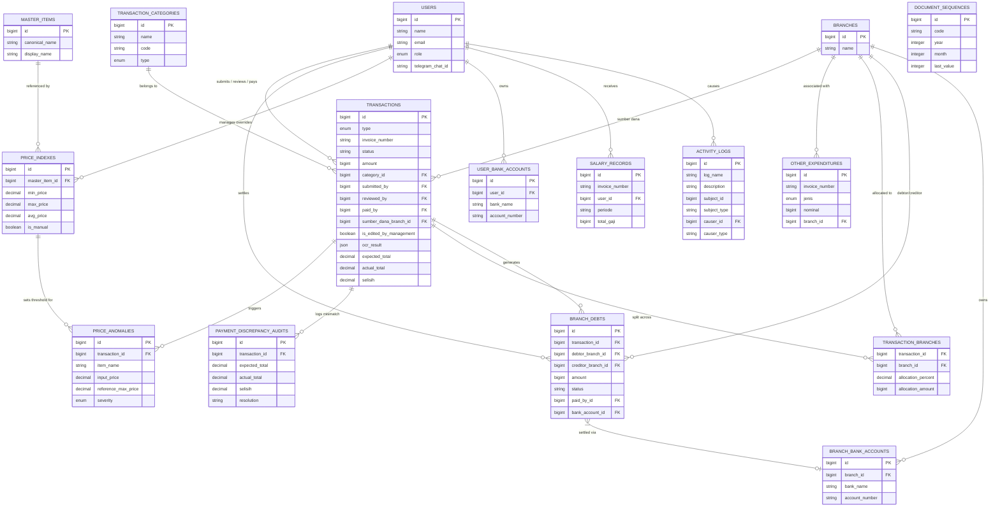

# WHUSNET Admin Payment - DATABASE SCHEMA

This document provides a comprehensive overview of the database structure for the **WHUSNET Admin Payment** project.

## Overview
The system uses a MySQL database to manage financial transactions, multi-branch allocations, inter-branch debts, and AI-powered OCR verification. The schema is designed to support a multi-role workflow (Owner, Atasan, Admin, Teknisi) and maintain a detailed audit trail.

## Database Visualization (ER Diagram)

---

## Core Tables

### `users`
Manages authentication and role-based access control.

| Column Name | Data Type | Key | Description |
|---|---|---|---|
| id | bigint | PK | Unique identifier for the user. |
| name | string | | User's full name. |
| email | string | Unique | Login email address. |
| password | string | | Hashed password for authentication. |
| role | enum | Index | Permissions level: `teknisi`, `admin`, `atasan`, `owner`. |
| telegram_chat_id | string | Index | ID for Telegram bot notifications (Nullable). |
| email_verified_at| timestamp | | Timestamp when email was verified. |
| remember_token | string | | Laravel remember token for sessions. |
| created_at | timestamp | | Record creation timestamp. |
| updated_at | timestamp | | Last update timestamp. |

### `branches`
Represents physical or logical business units.

| Column Name | Data Type | Key | Description |
|---|---|---|---|
| id | bigint | PK | Unique identifier for the branch. |
| name | string | Unique | Name of the branch (e.g., "Pusat", "Cabang A"). |
| created_at | timestamp | | Record creation timestamp. |
| updated_at | timestamp | | Last update timestamp. |

### `transactions`
The central table for all financial activities (Rembush, Pengajuan, Gudang).

| Column Name | Data Type | Key | Description |
|---|---|---|---|
| id | bigint | PK | Unique identifier for the transaction. |
| type | enum | Index | Transaction type: `rembush`, `pengajuan`, `gudang`. |
| invoice_number | string | Unique | System-generated ID (e.g., `UP-202604-00001`). |
| status | string | Index | Workflow status: `pending`, `approved`, `waiting_payment`, `completed`, `rejected`. |
| amount | bigint | | Total nominal amount of the transaction. |
| category_id | bigint | FK | Reference to `transaction_categories.id`. |
| customer | string | | Customer/Project name (Nullable). |
| vendor | string | | Vendor name (Nullable). |
| description | text | | Detailed notes or description. |
| submitted_by | bigint | FK | User who submitted the record (`users.id`). |
| reviewed_by | bigint | FK | Manager who approved/reviewed (`users.id`). |
| paid_by | bigint | FK | Admin who processed payment (`users.id`). |
| sumber_dana_branch_id| bigint | FK | Branch providing the initial funds (`branches.id`). |
| is_edited_by_management| boolean | | Flag indicating if management modified technician data. |
| items_snapshot | json | | Snapshot of original technician input for audit trail. |
| invoice_file_path | string | | Storage path for the uploaded invoice/nota. |
| bukti_transfer | string | | Storage path for the payment proof. |
| expected_total | decimal | | Total amount expected by the submitter/AI. |
| actual_total | decimal | | Total amount extracted by OCR AI. |
| selisih | decimal | | Difference between expected and actual total. |
| ocr_result | json | | Full JSON output from OCR extraction. |
| ocr_confidence | float | | Confidence score of the AI extraction. |
| tax_amount | decimal | | PPN amount extracted from the invoice. |
| discount_amount | decimal | | Discount amount extracted from the invoice. |
| shipping_amount | decimal | | Shipping fees extracted from the invoice. |
| service_fee | decimal | | Service/Platform fees extracted from the invoice. |
| created_at | timestamp | | Record creation timestamp. |
| updated_at | timestamp | | Last update timestamp. |

### `branch_debts`
Tracks inter-branch financial obligations arising from split payments.

| Column Name | Data Type | Key | Description |
|---|---|---|---|
| id | bigint | PK | Unique identifier for the debt record. |
| transaction_id | bigint | FK | Parent transaction causing this debt (`transactions.id`). |
| debtor_branch_id | bigint | FK | Branch that owes money (`branches.id`). |
| creditor_branch_id| bigint | FK | Branch that paid the amount (`branches.id`). |
| amount | bigint | | Nominal amount of debt. |
| status | string | Index | Debt status: `pending` or `paid`. |
| payment_method | string | | `transfer` or `cash`. |
| payment_proof | string | | Path to repayment proof image (Optional for cash). |
| paid_by_id | bigint | FK | User who settled the debt (`users.id`). |
| bank_account_id | bigint | FK | Destination bank for transfer (`branch_bank_accounts.id`). |
| sender_bank_account_id| bigint | FK | Source bank used for repayment (`branch_bank_accounts.id`). |
| paid_at | timestamp | | Timestamp when the debt was settled. |
| notes | text | | Additional notes for repayment. |
| created_at | timestamp | | Record creation timestamp. |
| updated_at | timestamp | | Last update timestamp. |

---

## Support & Extension Tables

### `transaction_branches` (Pivot)
Handles multi-branch allocation for a single transaction.

| Column Name | Data Type | Key | Description |
|---|---|---|---|
| transaction_id | bigint | FK | Reference to `transactions.id`. |
| branch_id | bigint | FK | Reference to `branches.id`. |
| allocation_percent| decimal | | Percentage share allocated to this branch. |
| allocation_amount | bigint | | Calculated nominal share for this branch. |

### `transaction_categories`
Categorizes transactions for reporting and filtering.

| Column Name | Data Type | Key | Description |
|---|---|---|---|
| id | bigint | PK | Unique identifier for the category. |
| name | string | Unique | Category name (e.g., "Bensin", "Alat Tulis"). |
| code | string | Unique | Short code for identification. |
| type | enum | Index | Scoped to `rembush` or `pengajuan`. |
| sort_order | integer | | UI display ordering. |
| is_active | boolean | | Active status for selection. |
| created_at | timestamp | | Record creation timestamp. |
| updated_at | timestamp | | Last update timestamp. |

### `master_items`
Standardized list of items for price consistency.

| Column Name | Data Type | Key | Description |
|---|---|---|---|
| id | bigint | PK | Unique identifier for the item. |
| canonical_name | string | Unique | Normalized name for matching. |
| display_name | string | | Human-readable name. |
| category | string | | Item category. |
| status | enum | | `active`, `discontinued`, `pending_approval`. |
| created_at | timestamp | | Record creation timestamp. |
| updated_at | timestamp | | Last update timestamp. |

### `price_indexes`
Market price tracking and manual overrides.

| Column Name | Data Type | Key | Description |
|---|---|---|---|
| id | bigint | PK | Unique identifier for the price index. |
| master_item_id | bigint | FK | Link to `master_items.id`. |
| item_name | string | Index | String name used for fallback matching. |
| min_price | decimal | | Calculated market minimum price. |
| max_price | decimal | | Calculated market maximum price. |
| avg_price | decimal | | Calculated market average price. |
| is_manual | boolean | | True if management set a fixed reference price. |
| manual_set_by | bigint | FK | Manager who set manual price (`users.id`). |
| manual_reason | text | | Reason for manual price override. |
| created_at | timestamp | | Record creation timestamp. |
| updated_at | timestamp | | Last update timestamp. |

### `price_anomalies`
Flags transactions exceeding market price thresholds.

| Column Name | Data Type | Key | Description |
|---|---|---|---|
| id | bigint | PK | Unique identifier for the anomaly. |
| transaction_id | bigint | FK | Linked transaction (`transactions.id`). |
| item_name | string | | Name of the offending item. |
| input_price | decimal | | Price submitted by technician. |
| reference_max_price| decimal | | Max price from `price_indexes`. |
| severity | enum | Index | `low`, `medium`, `critical`. |
| status | string | Index | `pending`, `reviewed`, `approved`, `rejected`. |
| created_at | timestamp | | Record creation timestamp. |
| updated_at | timestamp | | Last update timestamp. |

### `other_expenditures`
Standalone financial records for non-operational costs (PL- prefix).

| Column Name | Data Type | Key | Description |
|---|---|---|---|
| id | bigint | PK | Unique identifier for the record. |
| invoice_number | string | Unique | System ID (e.g., `PL-202604-00001`). |
| jenis | enum | Index | `bayar_hutang`, `piutang_usaha`, `prive`. |
| nominal | bigint | | Nominal amount. |
| branch_id | bigint | FK | Related branch (`branches.id`). |
| status | string | Index | `pending`, `approved`, `rejected`. |
| created_at | timestamp | | Record creation timestamp. |
| updated_at | timestamp | | Last update timestamp. |

### `salary_records`
Payroll management (GP- prefix).

| Column Name | Data Type | Key | Description |
|---|---|---|---|
| id | bigint | PK | Unique identifier for the record. |
| invoice_number | string | Unique | System ID (e.g., `GP-202604-00001`). |
| user_id | bigint | FK | Recipient employee (`users.id`). |
| periode | string | | Payment month/year. |
| total_gaji | bigint | | Final calculated net salary. |
| status | enum | Index | `draft`, `approved`, `paid`. |
| created_at | timestamp | | Record creation timestamp. |
| updated_at | timestamp | | Last update timestamp. |

---

## Banking & Metadata

### `user_bank_accounts`
Bank details for Technicians/Admins.

| Column Name | Data Type | Key | Description |
|---|---|---|---|
| id | bigint | PK | Unique identifier for the bank account. |
| user_id | bigint | FK | Owner of the account (`users.id`). |
| bank_name | string | | Name of the bank (BCA, Mandiri, etc.). |
| account_number | string | | Bank account number. |
| account_name | string | | Name registered on the bank account. |

### `branch_bank_accounts`
Official bank accounts for each branch.

| Column Name | Data Type | Key | Description |
|---|---|---|---|
| id | bigint | PK | Unique identifier for the bank account. |
| branch_id | bigint | FK | Branch owner (`branches.id`). |
| bank_name | string | | Name of the bank. |
| account_number | string | | Bank account number. |
| account_name | string | | Name registered on the bank account. |

### `payment_discrepancy_audits`
Logs every instance where OCR AI detects a mismatch.

| Column Name | Data Type | Key | Description |
|---|---|---|---|
| id | bigint | PK | Unique identifier for the audit record. |
| transaction_id | bigint | FK | Affected transaction (`transactions.id`). |
| expected_total | decimal | | Amount expected by user. |
| actual_total | decimal | | Amount detected by AI. |
| selisih | decimal | | Discrepancy nominal. |
| resolution | string | Index | `pending`, `force_approved`, `rejected`. |

---

## Infrastructure & System Tables

### `activity_logs`
System-wide audit trail.

| Column Name | Data Type | Key | Description |
|---|---|---|---|
| id | bigint | PK | Unique identifier for the log. |
| log_name | string | Index | Category (e.g., `transaction`, `user`). |
| description | text | | Description of the action performed. |
| subject_id | bigint | Index | ID of the entity affected. |
| subject_type | string | Index | Model class of the entity affected. |
| causer_id | bigint | Index | ID of the user who performed the action. |
| causer_type | string | Index | Model class of the user. |
| properties | json | | Old vs New values for audit. |

### `document_sequences`
Redis-fallback sequential ID generator.

| Column Name | Data Type | Key | Description |
|---|---|---|---|
| id | bigint | PK | Unique identifier. |
| code | string | Index | Prefix code (UP, PL, GP). |
| year | integer | | Sequence year. |
| month | integer | | Sequence month. |
| last_value | integer | | Last used sequence number. |

---

## Key Relationships Summary

1.  **Transaction Flow**:
    *   A `User` (Teknisi) submits a `Transaction`.
    *   The `Transaction` is linked to multiple `Branches` via `transaction_branches`.
    *   If a transaction is paid by one branch but allocated to others, `BranchDebt` records are automatically generated between the branches.
2.  **Price Control**:
    *   Items in a `Transaction` are checked against `PriceIndex` (which references `MasterItem`).
    *   If prices are too high, a `PriceAnomaly` is created and flagged for Management review.
3.  **Audit Trail**:
    *   Changes made by management are tracked via `is_edited_by_management` and `items_snapshot` in the `transactions` table.
    *   Every discrepancy detected by AI is logged in `payment_discrepancy_audits`.
4.  **Settlement**:
    *   `BranchDebt` records must be settled (status `paid`) before the parent `Transaction` can transition to `completed`.
    *   Repayment can be via `transfer` (requiring `branch_bank_accounts`) or `cash`.

---

## System & Infrastructure Tables

These tables are managed by the Laravel framework and its packages for core functionality.

### Authentication & Sessions
- **`password_reset_tokens`**: Stores tokens for password recovery.
- **`sessions`**: Manages user session data (id, user_id, ip_address, payload, last_activity).

### Cache & Performance
- **`cache`**: Stores cached items for faster access.
- **`cache_locks`**: Manages atomic locks for concurrent processes.

### Queue & Job Management
- **`jobs`**: Primary table for background job processing.
- **`job_batches`**: Tracks groups of related jobs (batches).
- **`failed_jobs`**: Logs details of jobs that failed after all retries.

### Monitoring & Debugging (Pulse)
- **`pulse_entries`**: Main store for Pulse's monitoring data (requests, jobs, exceptions, etc.).
- **`pulse_aggregates`**: Aggregated metrics for Pulse.
- **`pulse_values`**: Time-series values for Pulse metrics.
