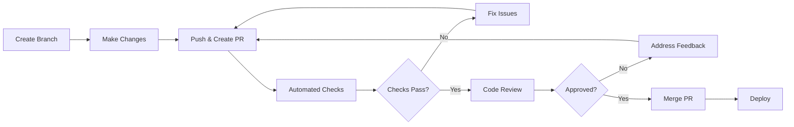

# 📋 Code Review Documentation

**Last Updated:** 4 Mei 2026  
**Purpose:** Comprehensive code review system documentation

---

## 📚 Overview

This directory contains all documentation related to the code review process, including setup guides, guidelines, and best practices for maintaining code quality through peer review.

---

## 📂 Documentation Structure

```
docs/code-review/
├── README.md                          # This file (overview)
├── CODE_REVIEW_SETUP.md              # Complete setup guide
├── CODE_REVIEW_GUIDELINES.md         # Detailed review guidelines
├── CODE_REVIEW_QUICK_REFERENCE.md    # Quick reference guide
└── BRANCH_PROTECTION_SETUP.md        # Branch protection configuration
```

---

## 🚀 Quick Navigation

### 👋 New to Code Review?
Start here:
1. 📖 [CODE_REVIEW_SETUP.md](CODE_REVIEW_SETUP.md) - Complete system overview
2. 📋 [CODE_REVIEW_GUIDELINES.md](CODE_REVIEW_GUIDELINES.md) - How to review code
3. ⚡ [CODE_REVIEW_QUICK_REFERENCE.md](CODE_REVIEW_QUICK_REFERENCE.md) - Quick commands

### 👨‍💼 Repository Admin?
Essential reads:
1. 🔧 [CODE_REVIEW_SETUP.md](CODE_REVIEW_SETUP.md) - System setup
2. 🔒 [BRANCH_PROTECTION_SETUP.md](BRANCH_PROTECTION_SETUP.md) - Branch protection
3. 👥 [CODEOWNERS](../../.github/CODEOWNERS) - Reviewer assignment

### 👨‍💻 Developer?
Quick access:
1. 📋 [CODE_REVIEW_GUIDELINES.md](CODE_REVIEW_GUIDELINES.md) - Review process
2. ⚡ [CODE_REVIEW_QUICK_REFERENCE.md](CODE_REVIEW_QUICK_REFERENCE.md) - Commands
3. 📝 [Pull Request Template](../../.github/pull_request_template.md) - PR format

---

## 📖 Documentation Details

### 1. CODE_REVIEW_SETUP.md
**Purpose:** Complete code review system setup guide  
**Audience:** Repository admins, team leads  
**Contents:**
- System architecture overview
- Installation and configuration
- GitHub Actions workflows
- CODEOWNERS setup
- Branch protection rules
- Troubleshooting guide

**When to use:**
- Setting up code review for the first time
- Configuring automated checks
- Understanding the complete system

### 2. CODE_REVIEW_GUIDELINES.md
**Purpose:** Detailed code review process and best practices  
**Audience:** All developers  
**Contents:**
- Review process workflow
- What to look for in reviews
- How to give constructive feedback
- Review checklist
- Common patterns and anti-patterns
- Examples of good reviews

**When to use:**
- Before reviewing a pull request
- Learning how to review effectively
- Understanding review standards

### 3. CODE_REVIEW_QUICK_REFERENCE.md
**Purpose:** Quick reference for common commands and workflows  
**Audience:** All developers  
**Contents:**
- Git commands for review
- GitHub CLI commands
- Common review scenarios
- Quick checklist
- Keyboard shortcuts

**When to use:**
- During daily development
- Quick command lookup
- Fast workflow reference

### 4. BRANCH_PROTECTION_SETUP.md
**Purpose:** Branch protection configuration guide  
**Audience:** Repository admins  
**Contents:**
- Branch protection rules
- Required status checks
- Approval requirements
- Merge restrictions
- Step-by-step setup

**When to use:**
- Configuring branch protection
- Updating protection rules
- Troubleshooting merge issues

---

## 🔗 Related Documentation

### GitHub Configuration
- [GitHub README](../../.github/README.md) - GitHub configuration overview
- [CODEOWNERS](../../.github/CODEOWNERS) - Automatic reviewer assignment
- [Pull Request Template](../../.github/pull_request_template.md) - PR template
- [Workflows](../../.github/workflows/) - GitHub Actions workflows

### Contributing
- [CONTRIBUTING.md](../contributing/CONTRIBUTING.md) - Contribution guidelines
- [Git Workflow](../contributing/CONTRIBUTING.md#development-workflow) - Git workflow
- [Code Style](../contributing/CONTRIBUTING.md#coding-standards) - Coding standards

### Main Documentation
- [DOCUMENTATION_INDEX.md](../../DOCUMENTATION_INDEX.md) - Complete documentation index
- [README.md](../../README.md) - Project overview

---

## 🎯 Code Review Process Overview



### Key Steps:

1. **Create Feature Branch**
   ```bash
   git checkout develop
   git checkout -b feature/my-feature
   ```

2. **Make Changes & Commit**
   ```bash
   git add .
   git commit -m "feat: add new feature"
   ```

3. **Push & Create PR**
   ```bash
   git push origin feature/my-feature
   # Open PR on GitHub
   ```

4. **Automated Checks Run**
   - PHPUnit tests
   - Code style (Laravel Pint)
   - Security scan (Trivy)
   - PR validation

5. **Code Review**
   - Reviewers assigned automatically
   - Review code changes
   - Leave comments and suggestions

6. **Address Feedback**
   ```bash
   # Make changes
   git add .
   git commit -m "fix: address review feedback"
   git push origin feature/my-feature
   ```

7. **Approval & Merge**
   - Get required approvals
   - Resolve all conversations
   - Merge to target branch

---

## ✅ Code Review Checklist

### Before Creating PR
- [ ] Code follows project style guide
- [ ] All tests pass locally
- [ ] No debug statements or console.logs
- [ ] Documentation updated if needed
- [ ] Commit messages follow conventions
- [ ] Branch is up to date with target

### During Review
- [ ] Code is readable and maintainable
- [ ] Logic is correct and efficient
- [ ] Edge cases are handled
- [ ] Security considerations addressed
- [ ] Performance implications considered
- [ ] Tests cover new functionality

### Before Merging
- [ ] All automated checks pass
- [ ] Required approvals received
- [ ] All conversations resolved
- [ ] No merge conflicts
- [ ] Documentation updated
- [ ] CHANGELOG updated (if applicable)

---

## 🛠️ Tools & Automation

### Automated Checks
- **PHPUnit** - Unit and feature tests
- **Laravel Pint** - Code style enforcement
- **Trivy** - Security vulnerability scanning
- **PR Validation** - Title format, size, conflicts

### GitHub Actions Workflows
- `code-review.yml` - Automated code review checks
- `test.yml` - Test suite execution
- `security-scan.yml` - Security scanning

### GitHub Features
- **CODEOWNERS** - Automatic reviewer assignment
- **Branch Protection** - Enforce review requirements
- **Status Checks** - Required checks before merge
- **PR Templates** - Standardized PR format

---

## 📊 Review Metrics

Track these metrics to improve the review process:

- **Review Time** - Average time from PR creation to merge
- **Approval Rate** - Percentage of PRs approved on first review
- **Iteration Count** - Average number of review cycles
- **Coverage** - Test coverage trends
- **Security** - Number of security issues found

---

## 🎓 Best Practices

### For Authors
1. Keep PRs small and focused
2. Write clear PR descriptions
3. Respond to feedback promptly
4. Test thoroughly before requesting review
5. Update documentation with code changes

### For Reviewers
1. Review promptly (within 24 hours)
2. Be constructive and respectful
3. Focus on important issues
4. Explain your reasoning
5. Approve when ready, don't nitpick

### For Teams
1. Establish clear review standards
2. Rotate reviewers regularly
3. Share knowledge through reviews
4. Celebrate good code
5. Learn from mistakes

---

## 🚨 Common Issues & Solutions

### Issue: PR Too Large
**Solution:** Break into smaller PRs
```bash
git checkout -b feature/part-1
# Cherry-pick specific commits
git cherry-pick <commit-hash>
```

### Issue: Merge Conflicts
**Solution:** Rebase on target branch
```bash
git fetch origin
git rebase origin/develop
# Resolve conflicts
git push --force-with-lease
```

### Issue: Failed Checks
**Solution:** Run checks locally
```bash
# Run tests
php artisan test

# Run code style
./vendor/bin/pint

# Check for issues
composer audit
```

### Issue: Slow Reviews
**Solution:** 
- Tag specific reviewers
- Break PR into smaller pieces
- Provide clear context in description
- Follow up in team chat

---

## 📞 Support

### Getting Help
1. Check documentation in this directory
2. Review [CODE_REVIEW_GUIDELINES.md](CODE_REVIEW_GUIDELINES.md)
3. Ask in team chat
4. Contact tech lead

### Contacts
- **Tech Lead:** techlead@example.com
- **DevOps Team:** devops@example.com

---

## 📚 Additional Resources

### Internal
- [Contributing Guide](../contributing/CONTRIBUTING.md)
- [Quick Start](../getting-started/QUICK_START.md)
- [Architecture](../architecture/ARCHITECTURE_DIAGRAM.md)

### External
- [GitHub Code Review Best Practices](https://docs.github.com/en/pull-requests/collaborating-with-pull-requests/reviewing-changes-in-pull-requests/about-pull-request-reviews)
- [Conventional Commits](https://www.conventionalcommits.org/)
- [Laravel Best Practices](https://github.com/alexeymezenin/laravel-best-practices)
- [Google Code Review Guidelines](https://google.github.io/eng-practices/review/)

---

## 📅 Maintenance

### Regular Updates
- Review and update guidelines quarterly
- Update automation workflows as needed
- Gather team feedback monthly
- Track and improve metrics

### Version History
- **v1.0.0** (2026-05-04) - Initial documentation structure
- Future updates will be tracked here

---

**Version:** 1.0.0  
**Last Updated:** 4 Mei 2026  
**Maintained By:** Development Team

For questions or suggestions, open an issue or contact the team! 🚀
