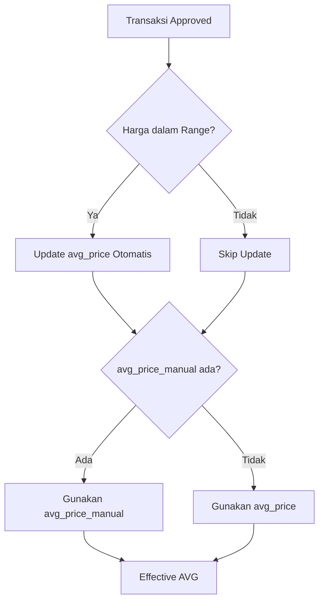

# 🎯 Price Index AVG System - Quick Reference

## 📌 Konsep Dasar

Sistem Price Index menggunakan **Dual-Mode AVG System**:

1. **`avg_price`** (Otomatis) - Dihitung real-time dari transaksi
2. **`avg_price_manual`** (Manual) - Override manual oleh Owner/Atasan

**Prioritas:** Manual > Auto

```
Jika avg_price_manual IS NOT NULL → Gunakan Manual
Jika avg_price_manual IS NULL     → Gunakan Auto
```

---

## 🔄 Alur Kerja Sistem



---

## 📊 Tabel Perbandingan

| Aspek | avg_price (Auto) | avg_price_manual (Manual) |
|-------|------------------|---------------------------|
| **Sumber** | Dihitung dari transaksi approved | Diset manual oleh Owner/Atasan |
| **Update** | Otomatis setiap ada transaksi baru | Hanya saat Owner edit manual |
| **Formula** | Incremental Moving Average | Input langsung |
| **Kondisi Update** | Harga dalam range [Min, Max] | Kapan saja Owner ingin |
| **Terpengaruh Transaksi** | ✅ Ya | ❌ Tidak |
| **Bisa NULL** | ❌ Tidak (selalu ada nilai) | ✅ Ya (default NULL) |
| **Prioritas** | Rendah | Tinggi |

---

## 🎬 Skenario Lengkap

### 1️⃣ Item Baru (Cold Start)
```
Transaksi #1: Rp 50,000
━━━━━━━━━━━━━━━━━━━━━━━━━━━━━━━━━━━━━━━━
avg_price        = Rp 50,000 ✅
avg_price_manual = NULL
Effective AVG    = Rp 50,000 (auto)
```

### 2️⃣ Transaksi Masuk Range
```
Existing: avg_price = Rp 50,000 (n=10)
Transaksi #11: Rp 52,000 (dalam range [45k-60k])

Formula: ((50,000 × 10) + 52,000) / 11 = 50,182
━━━━━━━━━━━━━━━━━━━━━━━━━━━━━━━━━━━━━━━━
avg_price        = Rp 50,182 ✅ Update
avg_price_manual = NULL
Effective AVG    = Rp 50,182 (auto)
```

### 3️⃣ Owner Set Manual
```
Owner set manual: Rp 55,000
Alasan: "Kontrak supplier 6 bulan"
━━━━━━━━━━━━━━━━━━━━━━━━━━━━━━━━━━━━━━━━
avg_price        = Rp 50,182 (tetap)
avg_price_manual = Rp 55,000 ✅ Set
Effective AVG    = Rp 55,000 (manual)
```

### 4️⃣ Transaksi Setelah Manual Override
```
Transaksi #12: Rp 51,000

Formula: ((50,182 × 11) + 51,000) / 12 = 50,265
━━━━━━━━━━━━━━━━━━━━━━━━━━━━━━━━━━━━━━━━
avg_price        = Rp 50,265 ✅ Update (background)
avg_price_manual = Rp 55,000 (tidak berubah)
Effective AVG    = Rp 55,000 (manual)

💡 avg_price tetap dihitung untuk tracking pasar!
```

### 5️⃣ Reset ke Auto
```
Owner hapus manual override
━━━━━━━━━━━━━━━━━━━━━━━━━━━━━━━━━━━━━━━━
avg_price        = Rp 50,265 (tetap)
avg_price_manual = NULL ✅ Dihapus
Effective AVG    = Rp 50,265 (auto)
```

---

## 🔧 API Endpoints

### 1. Set/Update AVG Manual
```http
POST /price-index/{id}/update-avg-manual
Content-Type: application/json

{
  "avg_price_manual": 55000,
  "manual_reason": "Kontrak supplier 6 bulan"
}
```

**Response:**
```json
{
  "success": true,
  "message": "Harga AVG Manual berhasil diset.",
  "data": {
    "avg_price": 50265,
    "avg_price_manual": 55000,
    "effective_avg": 55000
  }
}
```

### 2. Hapus AVG Manual (Reset ke Auto)
```http
POST /price-index/{id}/update-avg-manual
Content-Type: application/json

{
  "avg_price_manual": null
}
```

### 3. Lookup Price Index
```http
GET /api/price-index/lookup?item_name=Kabel NYM 3x2.5
```

**Response:**
```json
{
  "found": true,
  "item_name": "Kabel NYM 3x2.5",
  "min_price": 45000,
  "max_price": 60000,
  "avg_price": 50265,
  "avg_price_auto": 50265,
  "avg_price_manual": 55000,
  "is_avg_manual": true,
  "effective_avg": 55000,
  "formatted": {
    "min": "Rp 45.000",
    "max": "Rp 60.000",
    "avg": "Rp 55.000"
  }
}
```

---

## 💻 Code Examples

### Model Method: Get Effective AVG
```php
// File: app/Models/PriceIndex.php

public function getEffectiveAvgPrice(): float
{
    return $this->avg_price_manual ?? $this->avg_price;
}

public function isAvgManual(): bool
{
    return $this->avg_price_manual !== null;
}
```

### Service: Process Approved Item
```php
// File: app/Services/PriceIndex/PriceIndexService.php

public function processApprovedItem(string $itemName, float $price): ?PriceIndex
{
    $pi = PriceIndex::where('item_name', $itemName)->lockForUpdate()->first();
    
    // Hanya update jika harga dalam range
    if ($price >= $pi->min_price && $price <= $pi->max_price) {
        $oldTotal = $pi->total_transactions;
        $newTotal = $oldTotal + 1;
        $oldAvg   = $pi->avg_price;
        
        // Incremental Moving Average
        $newAvg = (($oldAvg * $oldTotal) + $price) / $newTotal;
        
        $pi->update([
            'avg_price'          => round($newAvg, 2),
            'total_transactions' => $newTotal,
            'last_calculated_at' => now(),
            // ⚠️ JANGAN sentuh avg_price_manual!
        ]);
    }
    
    return $pi;
}
```

### Controller: Update AVG Manual
```php
// File: app/Http/Controllers/PriceIndexController.php

public function updateAvgManual(Request $request, int $id)
{
    $request->validate([
        'avg_price_manual' => 'nullable|numeric|min:0',
        'manual_reason'    => 'nullable|string|max:500',
    ]);
    
    $priceIndex = PriceIndex::findOrFail($id);
    
    $priceIndex->update([
        'avg_price_manual' => $request->avg_price_manual,
        'manual_set_by'    => Auth::id(),
        'manual_set_at'    => now(),
        'manual_reason'    => $request->manual_reason,
    ]);
    
    return response()->json([
        'success' => true,
        'data' => [
            'avg_price'        => $priceIndex->avg_price,
            'avg_price_manual' => $priceIndex->avg_price_manual,
            'effective_avg'    => $priceIndex->getEffectiveAvgPrice(),
        ]
    ]);
}
```

---

## 🗄️ Database Schema

```sql
CREATE TABLE price_indexes (
    id BIGINT PRIMARY KEY,
    item_name VARCHAR(255),
    min_price DECIMAL(15,2),
    max_price DECIMAL(15,2),
    avg_price DECIMAL(15,2) NOT NULL,           -- Otomatis
    avg_price_manual DECIMAL(15,2) NULL,        -- Manual (opsional)
    total_transactions INT DEFAULT 0,
    is_manual BOOLEAN DEFAULT FALSE,
    manual_set_by BIGINT NULL,
    manual_set_at TIMESTAMP NULL,
    manual_reason TEXT NULL,
    last_calculated_at TIMESTAMP NULL,
    created_at TIMESTAMP,
    updated_at TIMESTAMP
);
```

---

## ✅ Checklist Testing

### Functional Testing
- [ ] Create price index baru → avg_price terisi, avg_price_manual NULL
- [ ] Approve transaksi dalam range → avg_price update otomatis
- [ ] Approve transaksi luar range → avg_price tidak berubah
- [ ] Set avg_price_manual → effective_avg gunakan manual
- [ ] Approve transaksi setelah manual → avg_price update, manual tetap
- [ ] Hapus avg_price_manual → effective_avg kembali ke auto
- [ ] API lookup → return semua field dengan benar
- [ ] UI menampilkan badge "Auto" vs "Manual (AVG)"

### Edge Cases
- [ ] avg_price_manual = 0 (valid, bukan NULL)
- [ ] avg_price_manual > max_price (warning?)
- [ ] avg_price_manual < min_price (warning?)
- [ ] Concurrent updates (race condition)
- [ ] NULL handling di frontend

---

## 🎯 Best Practices

### ✅ DO
- Selalu gunakan `getEffectiveAvgPrice()` untuk mendapatkan harga yang digunakan
- Simpan alasan (`manual_reason`) saat set manual untuk audit trail
- Tampilkan kedua nilai (auto & manual) di UI untuk transparansi
- Log setiap perubahan manual untuk compliance

### ❌ DON'T
- Jangan update `avg_price_manual` secara otomatis dari transaksi
- Jangan hapus `avg_price` saat ada `avg_price_manual`
- Jangan lupa handle NULL di frontend (avg_price_manual bisa NULL)
- Jangan skip validasi range saat set manual

---

## 📞 Troubleshooting

### Problem: avg_price tidak update setelah approval
**Solusi:**
1. Cek apakah harga dalam range [min_price, max_price]
2. Cek log: `grep "PriceIndex" storage/logs/laravel.log`
3. Verify `total_transactions` increment

### Problem: Effective AVG tidak sesuai
**Solusi:**
1. Cek `avg_price_manual` → jika ada, itu yang digunakan
2. Gunakan method `getEffectiveAvgPrice()` bukan langsung `avg_price`
3. Clear cache: `php artisan cache:clear`

### Problem: Manual override hilang setelah approval
**Solusi:**
1. Pastikan service TIDAK update `avg_price_manual`
2. Cek code: `avg_price_manual` harus di-exclude dari update
3. Review git diff untuk memastikan tidak ada perubahan tidak sengaja

---

## 📚 Referensi

- **Dokumentasi Lengkap**: `PRICE_INDEX_DOCS.md`
- **Implementasi Detail**: `IMPLEMENTASI_AVG_MANUAL.md`
- **API Documentation**: `/docs/api` (Scramble)
- **Database Migrations**: `database/migrations/*price_indexes*`

---

**Last Updated:** 4 Mei 2026  
**Version:** 2.0 (Dual-Mode AVG System)
