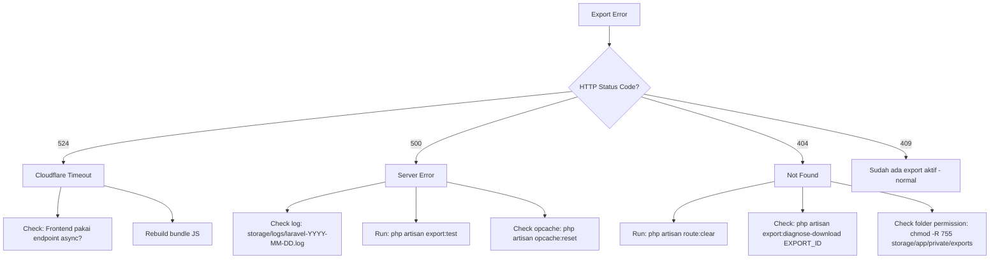

# 🔧 Export Excel — Troubleshooting Guide

Panduan diagnosa & fix untuk masalah pada sistem export Laporan Transaksi (`Layer 1 + 2 + 3`).

**Last Updated:** 28 Mei 2026  
**Related Doc:** [Export Optimization](../features/EXPORT_OPTIMIZATION.md)

---

## 📋 Daftar Isi

1. [Quick Diagnosis Flow](#-quick-diagnosis-flow)
2. [Error 524 — Cloudflare Timeout](#-error-524--cloudflare-timeout)
3. [Error 500 — Internal Server Error](#-error-500--internal-server-error)
4. [Error 404 — File Not Found saat Download](#-error-404--file-not-found-saat-download)
5. [Progress Stuck di 0%](#-progress-stuck-di-0)
6. [Reverb Tidak Konek (Polling Saja yang Jalan)](#-reverb-tidak-konek-polling-saja-yang-jalan)
7. [Memory Limit Exceeded](#-memory-limit-exceeded)
8. [OpCache Tidak Revalidate](#-opcache-tidak-revalidate)
9. [Permission Folder 700](#-permission-folder-700)
10. [Common Commands](#-common-commands)

---

## 🚦 Quick Diagnosis Flow



---

## 🌩️ Error 524 — Cloudflare Timeout

### Symptom

```
GET https://your-domain.com/transactions/export?month=5&year=2026... 524
[Export] Error: Server error 524
```

### Akar Masalah

Cloudflare default timeout = 100 detik. Request synchronous ke endpoint sync (`/transactions/export?...`) untuk dataset besar lewat batas itu.

**Indikator visual:** browser hit endpoint lama dengan **GET** (bukan **POST** ke `/queue`).

### Fix

**Solusi 1: Pastikan frontend pakai endpoint async (POST)**

```bash
# 1. Rebuild bundle JS
docker compose exec node npm run build

# 2. Cek manifest baru ter-generate
docker compose exec app cat public/build/manifest.json | head -20

# 3. Purge Cloudflare cache
# Login Cloudflare dashboard → Caching → Configuration → Purge Everything

# 4. Browser hard reload
# Chrome/Edge: Ctrl+Shift+R
# Firefox: Ctrl+F5
```

Verifikasi di DevTools Network tab:
- ✅ Request **POST** ke `/transactions/export/queue`
- ✅ Hash JS file di DevTools **berbeda** dari versi cached lama
- ❌ Bukan GET ke `/transactions/export?...`

**Solusi 2: Endpoint sync sekarang juga sudah dioptimasi**

Endpoint legacy `/transactions/export` tetap bekerja tapi sekarang pakai OpenSpout (Layer 1). Untuk dataset <10k rows tetap aman; untuk 40k+ tetap rentan timeout 524.

Untuk dataset besar, **gunakan endpoint async**.

---

## 💥 Error 500 — Internal Server Error

### Symptom

```
POST /transactions/export/queue 500
GET  /transactions/export/download/{id} 500
```

### Akar Masalah (Common)

| Cause | Fix |
|-------|-----|
| Migration belum jalan | `php artisan migrate` |
| Vendor belum updated | `composer install --no-dev` |
| OpCache hold code lama | Restart container app |
| Permission folder restrictive | `chmod -R 755 storage/app/private/exports` |
| Connection Redis fail | Cek `.env` dan service redis |

### Diagnosis Step-by-Step

**Step 1: Check log Laravel**

```bash
docker compose exec app sh -c "tail -100 storage/logs/laravel-$(date +%Y-%m-%d).log"
```

Cari baris yang dimulai dengan `[ExportController]` atau `production.ERROR`.

**Step 2: Check Tabel Database**

```bash
docker compose exec app php artisan tinker --execute="var_dump(Schema::hasTable('transaction_export_jobs'));"
```

Jika `false` → run `php artisan migrate`.

**Step 3: Check Vendor**

```bash
docker compose exec app ls vendor/openspout/openspout/src/Writer/XLSX/
```

Jika directory kosong → run `composer install --no-dev`.

**Step 4: Run Diagnostic Command**

```bash
docker compose exec app php artisan export:test --type=rembush --month=5 --year=2026
```

Output akan menunjukkan **persis dimana** error terjadi (file + line number).

**Step 5: Check Redis**

```bash
docker compose exec app php artisan tinker --execute="echo Redis::ping();"
```

Output `+PONG` = OK. Jika error → Redis tidak konek, cek `.env`:

```env
REDIS_HOST=redis
REDIS_PORT=6379
QUEUE_CONNECTION=redis
```

---

## 🔍 Error 404 — File Not Found saat Download

### Symptom

```
GET /transactions/export/download/{exportId} 404
```

Padahal job sudah `completed` dan file ada di disk.

### Akar Masalah (Most Common: Route Cache Stale)

Bootstrap cache `bootstrap/cache/routes-v7.php` di-build sebelum route export ditambahkan. Saat HTTP request masuk, Laravel pakai cached routes yang **tidak punya** route export download → return 404 generik.

### Fix

```bash
# Clear semua cache
docker compose exec app php artisan route:clear
docker compose exec app php artisan config:clear
docker compose exec app php artisan view:clear
docker compose exec app php artisan cache:clear

# Restart app supaya entrypoint.sh rebuild cache dengan kode terbaru
docker compose restart app
```

### Verifikasi

```bash
# Pastikan route ter-register
docker compose exec app php artisan route:list --name=transactions.export

# Output yang diharapkan:
# GET|HEAD   transactions/export                       transactions.export
# POST       transactions/export/queue                 transactions.export.queue
# GET|HEAD   transactions/export/status/{exportId}     transactions.export.status
# GET|HEAD   transactions/export/download/{exportId}   transactions.export.download
# GET|HEAD   transactions/export/sync                  transactions.export.sync
```

### Diagnosis Mendalam

```bash
docker compose exec app php artisan export:diagnose-download <export-uuid>
```

Output akan check:
- Route registered
- Export record di DB
- File path valid
- File exists di disk
- Permission readable

Kalau semua hijau tapi browser masih 404 → masalah di Nginx routing atau Cloudflare cache. Purge Cloudflare cache.

---

## ⏸️ Progress Stuck di 0%

### Symptom

Progress bar muncul tapi stuck di "Memproses... 0%" tidak update.

### Akar Masalah

| Cause | Symptom | Fix |
|-------|---------|-----|
| Horizon worker mati | `horizon:status` not running | `php artisan horizon:terminate` (auto restart) |
| Job di-pickup tapi gagal start | Error di Horizon log | Check & fix |
| Reverb down | Hanya progress dari polling | Restart reverb container |

### Fix

```bash
# Check Horizon
docker compose exec app php artisan horizon:status

# Check job antrian
docker compose exec app php artisan tinker --execute="echo Redis::llen('queues:default');"

# Check Horizon logs
docker compose logs -f horizon | grep ExportJob

# Restart Horizon
docker compose restart horizon
```

---

## 📡 Reverb Tidak Konek (Polling Saja yang Jalan)

### Symptom

Progress bar update tapi delay 2 detik (interval polling) — bukan real-time. Browser DevTools console:

```
WebSocket connection to 'wss://...' failed
```

### Diagnosis

```bash
# Check Reverb running
docker compose ps reverb

# Check port 8081 listening
docker compose exec reverb nc -z 127.0.0.1 8081 && echo "Reverb OK"

# Check Reverb logs
docker compose logs -f reverb
```

### Fix

**Cek `.env.production`:**

```env
REVERB_HOST=your-domain.com
REVERB_PORT=443
REVERB_SCHEME=https

VITE_REVERB_APP_KEY=...
VITE_REVERB_HOST=your-domain.com
VITE_REVERB_PORT=443
VITE_REVERB_SCHEME=https
```

⚠️ **Penting:** `VITE_*` di-bake saat build, jadi setelah ubah env perlu **rebuild frontend**:

```bash
docker compose exec node npm run build
docker compose restart reverb
```

**Sistem tidak crash tanpa Reverb** — JavaScript otomatis fallback ke polling setiap 2 detik via endpoint `/transactions/export/status/{id}`.

---

## 💾 Memory Limit Exceeded

### Symptom

Job failed dengan log:
```
PHP Fatal error: Allowed memory size of X bytes exhausted
```

### Akar Masalah

Untuk dataset >100k rows, default `memory_limit=128M` tidak cukup karena PhpSpreadsheet legacy code masih dipakai di branch tertentu, atau karena query tidak pakai `lazyById`.

### Fix

**Naikkan memory limit Horizon worker:**

`config/horizon.php`:
```php
'defaults' => [
    'supervisor-1' => [
        'memory' => 512,    // Naikkan dari 128
        'timeout' => 600,
    ],
],
```

`docker/php/production.ini`:
```ini
memory_limit = 512M
```

**Reduce chunk size:**

`app/Services/Export/TransactionExportWriter.php`:
```php
public const CHUNK_SIZE = 250;    // Default 500
```

**Restart:**

```bash
docker compose restart app horizon
```

---

## 🔥 OpCache Tidak Revalidate

### Symptom

Code PHP yang baru di-edit **tidak ber-efek** di HTTP request, padahal CLI command (artisan) sukses pakai code baru.

### Akar Masalah

Production config `opcache.validate_timestamps=0` artinya OpCache TIDAK PERNAH check perubahan file. PHP-FPM worker hold cached opcode dari awal.

### Indikator

- ✅ `php artisan export:test` pakai code baru
- ❌ HTTP request masih pakai code lama
- ❌ Aggressive logging yang ditambahkan tidak muncul di log saat HTTP request masuk

### Fix Sementara

```bash
# Reset opcache via CLI (TIDAK affect PHP-FPM workers — limited)
docker compose exec app php -r "opcache_reset(); echo 'reset';"

# Lebih baik: restart container app (force reload semua worker)
docker compose restart app
```

### Fix Permanen

**Opsi 1: Auto-reset di entrypoint** (untuk staging)

`docker/entrypoint.sh`:
```bash
echo "🔄 Resetting opcache..."
php -r "opcache_reset();" 2>/dev/null || true
```

**Opsi 2: Selalu restart container** setelah deploy

Tambahkan ke deployment script:
```bash
docker compose restart app horizon
```

**Opsi 3: Aktifkan revalidate** (untuk dev)

`docker/php/production.ini` (untuk dev environment, **JANGAN production**):
```ini
opcache.validate_timestamps = 1
opcache.revalidate_freq = 2
```

---

## 🔒 Permission Folder 700

### Symptom

CLI command `php artisan export:diagnose-download` semua hijau, tapi HTTP request 500. File ada di `/var/www/storage/app/private/exports/{userId}/{file}.xlsx`, ukuran valid, tapi PHP-FPM tidak bisa baca.

### Akar Masalah

Container `horizon` jalan sebagai `root` (default), sehingga folder yang dibuat lewat `Storage::makeDirectory()` punya permission `0700` (root only). Sementara PHP-FPM worker jalan sebagai `www-data` → tidak bisa baca.

### Indikator

```bash
docker compose exec app ls -la storage/app/private/exports/

# Jika permission 700:
# drwx------  3 root root  4096  ...  exports/
```

### Fix Sementara

```bash
# Fix permission existing folders
docker compose exec app sh -c "chmod -R 755 storage/app/private/exports"
docker compose exec app sh -c "find storage/app/private/exports -type f -name '*.xlsx' -exec chmod 644 {} +"
```

### Fix Permanen (Sudah Diterapkan)

`app/Jobs/ExportTransactionsJob.php` otomatis set permission saat write file:

```php
$disk->makeDirectory("exports/{$this->userId}");
@chmod($exportDir, 0755);
@chmod($userDir, 0755);
// ... write file ...
@chmod($absolutePath, 0644);
```

Jadi untuk export baru, permission otomatis benar.

---

## 🛠️ Common Commands

### Cek Status

```bash
# Status migration
docker compose exec app php artisan migrate:status | grep -i export

# List export routes
docker compose exec app php artisan route:list --name=transactions.export

# Status Horizon
docker compose exec app php artisan horizon:status

# Status Reverb (port check)
docker compose exec reverb nc -z 127.0.0.1 8081 && echo OK

# Cek vendor OpenSpout
docker compose exec app ls vendor/openspout/openspout/src/Writer/XLSX/
```

### Diagnostic Command

```bash
# Test full export flow
docker compose exec app php artisan export:test --type=rembush --month=5 --year=2026

# Diagnose specific download issue
docker compose exec app php artisan export:diagnose-download <export-uuid>

# Cleanup old export files
docker compose exec app php artisan exports:clean --hours=24
```

### Reset & Rebuild

```bash
# Clear all caches
docker compose exec app php artisan route:clear
docker compose exec app php artisan config:clear
docker compose exec app php artisan view:clear
docker compose exec app php artisan cache:clear

# Reset opcache (limited effect on FPM)
docker compose exec app php -r "opcache_reset();"

# Restart containers (apply code changes)
docker compose restart app horizon

# Rebuild frontend
docker compose exec node npm run build

# Full rebuild (kalau perlu update vendor)
docker compose build app horizon
docker compose up -d --force-recreate app horizon
```

### Monitoring

```bash
# Tail Laravel log realtime
docker compose exec app tail -f storage/logs/laravel-$(date +%Y-%m-%d).log

# Filter export controller logs
docker compose exec app sh -c "grep ExportController storage/logs/laravel-$(date +%Y-%m-%d).log | tail -30"

# Tail Horizon logs
docker compose logs -f horizon | grep ExportJob

# Tail Nginx access (cari request export)
docker compose logs --tail 100 nginx | grep "export"
```

### Cek File di Storage

```bash
# List semua export files
docker compose exec app ls -lh storage/app/private/exports/

# List untuk user spesifik
docker compose exec app ls -lh storage/app/private/exports/<user-id>/

# Cek size & permission satu file
docker compose exec app stat storage/app/private/exports/<user-id>/<export-id>.xlsx
```

---

## 📞 Eskalasi

Jika setelah ikuti langkah di atas masalah tidak teratasi, kumpulkan info berikut:

1. **Output diagnostic command:**
   ```bash
   docker compose exec app php artisan export:test --type=rembush --month=5 --year=2026
   ```

2. **Log Laravel hari ini (50 baris terakhir):**
   ```bash
   docker compose exec app tail -50 storage/logs/laravel-$(date +%Y-%m-%d).log
   ```

3. **Log Horizon hari ini:**
   ```bash
   docker compose logs --tail 100 horizon
   ```

4. **Cek environment:**
   ```bash
   docker compose exec app php artisan about
   ```

5. **Browser DevTools:**
   - Network tab — screenshot request export yang gagal
   - Console tab — copy error message

Lalu eskalasi ke tim development dengan info di atas.

---

## 📚 Related Documentation

- [Export Optimization](../features/EXPORT_OPTIMIZATION.md) — System architecture & design
- [Troubleshooting Index](README.md) — Other troubleshooting guides
- [Deployment Guide](../deployment/DOCKER_PRODUCTION_GUIDE.md) — Docker setup

---

**Last Updated:** 28 Mei 2026  
**Maintainer:** WHUSNET Development Team
